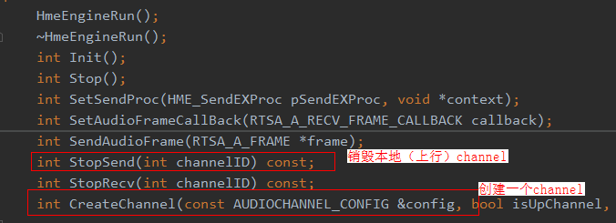
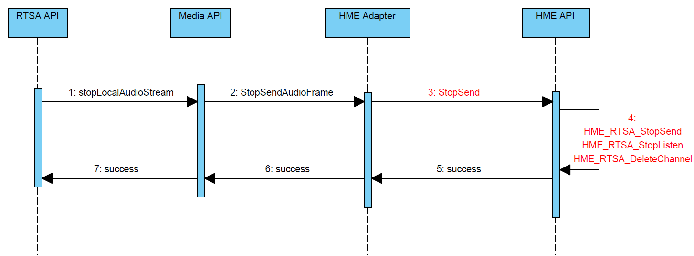
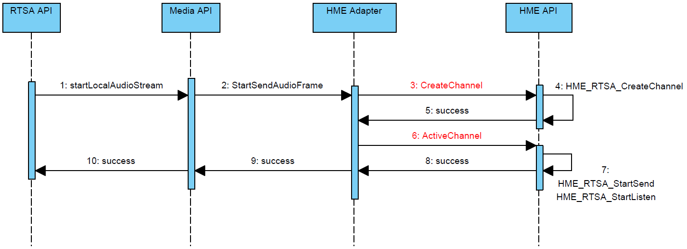
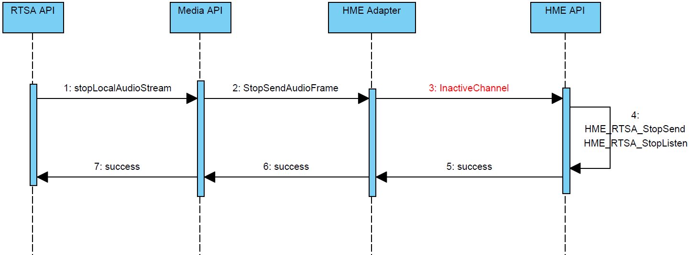
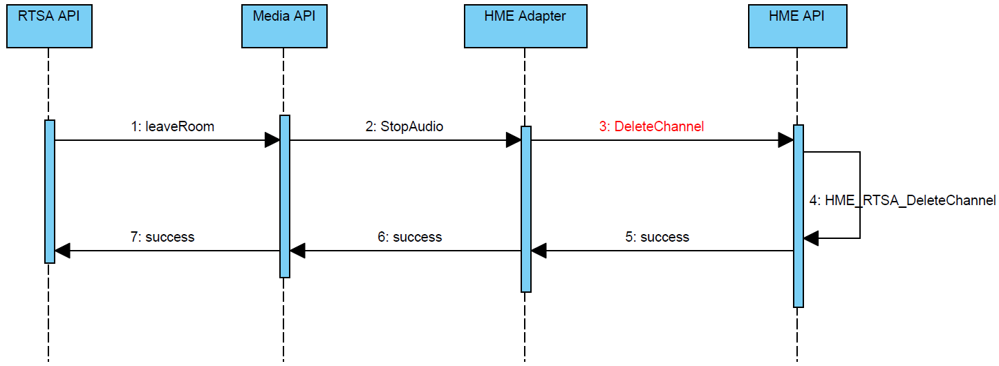

## RTSA Audio Channel复用

### 1、背景与分析
#### 1.1 背景
RTSA是一个支持实时音视频流发送的sdk。  
在发送音频流的过程中，按照以下步骤执行：  
1. 打开本地音频通道
2. 发送若干个音频包
3. 关闭本地音频通道
4. 再次开启音频通道
5. 再次发送音频包  

在步骤5中发现，前几个发送的音频包会丢失，即接收端无法收到前几个音频包。

#### 1.2 分析
RTSA项目主要使用了RTP协议来传输音视频流。在RTP包的头部，存在“序列号”字段。该字段可以表示多个RTP包之间的顺序。  
在项目中，**端侧每次“开关本地音频流”时都会重置改序列号，但是云侧则认为端侧（从加入房间至离开房间）的序列号一直是单调递增的。所以，云侧在解析端侧的RTP包时，如果发现具有相同序列号的RTP包，则认为是无效的包，会被丢弃**。  
因此，就会出现上一部分描述的问题：在发送端第二次发送音频包时，接收端总是无法收到前几个音频包。  

检查当前项目的代码，发现音频包的RTP头是在HME组件中封装的，且HME只有“创建-销毁Channel”的概念，没有“加入-离开房间”的概念。

  

从RTSA的接口调用链中可以看到，每次停止本地音频时，均会销毁对应的Channel。当第二次开启本地音频时，就会重新创建一个新的Channel。所以，会导致RTP包的序列号重置。  




### 2、核心修改点介绍

#### 2.1 功能描述
根据第二部分的分析，我们了解到，**需要RTSA对HME的调用进行抽象**。 所以本部分主要对修改的核心功能点进行描述。

**RTSA对HME抽象出如下几个接口**：
| 接口 | 描述 |
| -- | -- |
| `CreateChannel`     | 创建Channel，HME在此处初始化序列号
| `ActiveChannel`     | 激活Channel
| `InactiveChannel`   | 闲置Channel
| `DeleteChannel`     | 销毁Channel，HME在此处重置序列号

RTSA在上述接口封装的基础上，具体的调用顺序如下图所示：

1. 在加入房间时创建并激活Channel，用来发送本地音频流。  


2. 在关闭本地音频流时，对该Channel进行闲置。  


3. 在离开房间时才销毁该Channel。  


这样就**实现了RTP包序列号的连续以及Channel的复用**。

#### 2.2 代码优点
1. 代码微重构，将重复代码抽取成公共函数，减少的冗余代码，
2. 结合业务场景，合理抽象和封装底层模块接口，增强了可维护性和扩展性
3. 性能方面：资源重复利用，避免反复删除释放，提升运行效率

#### 2.3 代码展示

本修改点的核心代码展示如下所示：

- 激活Channel
```C++
int HmeEngineRun::ActiveChannel(int channelId, bool isUpChannel) const
{
    HME_LIB_RESULT hmeResult = HME_ERR_ERROR;
    int32 hmeErr = 0;
    if (isUpChannel) {
        hmeResult = HME_RTSA_StartSend(channelId);
        LOGI("HME_RTSA_StartSend chID:%d", channelId);
        if (hmeResult != HME_ERR_OK) {
            HME_LAST_ERROR_AUDIO("---Failed to call HME_RTSA_StartSend():%d");
            return hmeResult;
        }
    } else {
        LOGI("HME_RTSA_StartReceive chID:%d", channelId);
    }
    hmeResult = HME_RTSA_StartListen(channelId);
    LOGI("HME_RTSA_StartListen chID:%d", channelId);
    if (hmeResult != HME_ERR_OK) {
        HME_LAST_ERROR_AUDIO("---Failed to call HME_RTSA_StartListen():%d");
        return hmeResult;
    }
    return HME_ERR_OK;
}
```
- 闲置Channel
```C++
int HmeEngineRun::InactiveChannel(int channelId, bool isUpChannel) const
{
    // 只停止channel，不销毁
    // 1、StopListen
    HME_LIB_RESULT hmeResult = HME_ERR_ERROR;
    int32 hmeErr = 0;
    hmeResult = HME_RTSA_StopListen(channelId);
    LOGI("HME_StopListen channelId(%d)", channelId);
    if (hmeResult != HME_ERR_OK) {
        HME_LAST_ERROR_AUDIO("---Failed to call HME_StopListen():%d");
        return hmeResult;
    }
    if (isUpChannel) {
        // 2、StopSend
        hmeResult = HME_RTSA_StopSend(channelId);
        LOGI("HME_StopSend channelId(%d)", channelId);
        if (hmeResult != HME_ERR_OK) {
            HME_LAST_ERROR_AUDIO("---Failed to call HME_StopSend():%d");
            return hmeResult;
        }
    }
    return HME_ERR_OK;
}
```
- 调用  
```C++
int HwRtsaAudioManager::StartSendFrame(long ssrc, unsigned long long streamUid)
{
    // 略...

    int result = audioData->FindChannelbySSRC(&iChannel, ssrc);
    if (result == AUDIO_ERR_OK) {
        // 如果找到，说明这个channel已经被创建过
        // 复用Channel（内部调用ActiveChannel(),激活该通道）
        LOGI("send channel=%d already exists. upssrc=%ld, just active channel", iChannel, ssrc);
        return hmeEngAdp->ActiveSend(iChannel);
    }

    // 略...

    // 创建新的Channel（内部调用CreateChannel()方法,创建新通道）
    result = hmeEngAdp->StartSend(iChannel, audioData->GetAudioVersion(), stConfig);
    if (result != AUDIO_ERR_OK) {
        LOGE("hmeEngAdp->StartSend Failed upssrc=%ld", ssrc);
        return -1;
    }

    // 略...

    return 0;
}
```


### 3、结果
按照步骤一的方式重新测试发现，接收端不再出现丢包问题。

> MR：https://codehub-g.huawei.com/hms/RTCSDK/FusionRtcSdk/merge_requests/3582/diffs  
> DTS：https://dts-szv.clouddragon.huawei.com/DTSPortal/ticket/DTS2021122912677

#### 3.1 心得感受
1. 合理封装很重要，否则在接口约束差异较大的组件之间调用，上层模块调用下层模块就会出现重复甚至错误调用api的问题。
2. 及时抽象和删除冗余代码，这样可以减少维护的成本，提高系统的稳定性
3. 修改问题的时候也需要注意执行效率方面的问题，比如对资源进行合理的复用


