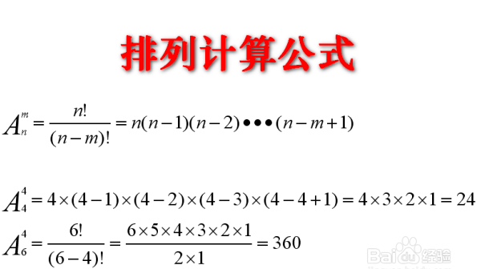
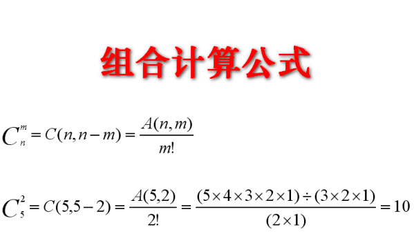

# 排列&组合

## 排列计算公式


### 示例代码
```java

```

## 组合计算公式


### 示例代码
```java

```

## 阶乘
```java

```
----------
## 把n个小球，放在m个盒子里共有多少种方法
> https://blog.csdn.net/zhangjie1989/article/details/51488402

这个问题一共有8中情况，分别为：
```bash
球同        盒同        盒可以空
        *           *               = 2*2*2 ，共8种情况
球不同      盒不同       盒不可以空
```


------------

## 打印集合的所有子集
```java
/**
 * 集合中无重复元素。得到该集合的所有子集
 * https://leetcode-cn.com/problems/subsets/
 */
public class Subset {

    /**
     * 思路一：
     * 逐个枚举，空集的幂集只有空集，每增加一个元素，让之前幂集中的每个集合，
     * 追加这个元素，就是新增的子集。
     *
     * @param nums 集合，元素不重复
     * @return 所有子集
     */
    public List<List<Integer>> subsets(int[] nums) {
        List<List<Integer>> result = new ArrayList<>();
        result.add(new ArrayList<>());

        for (int i : nums) {
            int size = result.size();
            for (int j = 0; j < size; j++) {
                List<Integer> newList = new ArrayList<>(result.get(j));
                newList.add(i);
                result.add(newList);
            }
        }
        return result;
    }
    
    public static void main(String[] args) {
        int[] nums = {1, 2, 3};
        List<List<Integer>> result = new Subset().subsets(nums);
        for (List<Integer> list : result) {
            System.out.println(list.toString());
        }
    }

}

```


