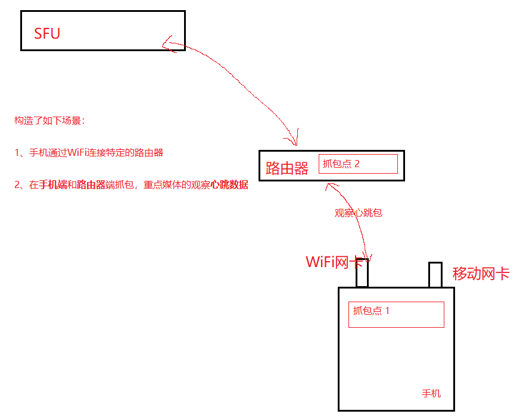
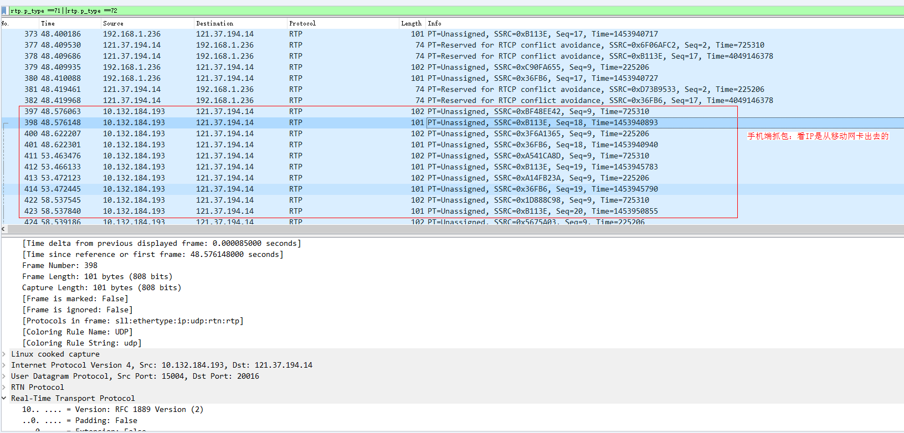
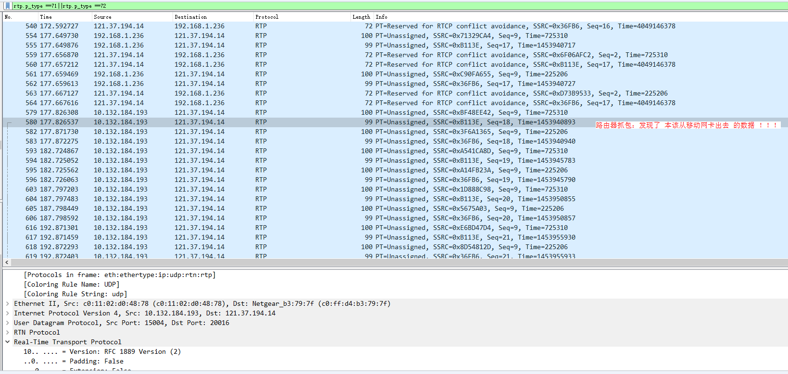
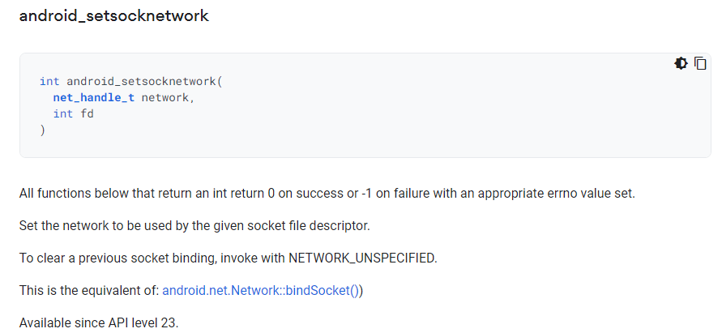

## 绑定网卡Nic

### 1、背景  
对接畅连App时由如下需求：手机A创建两个RTSA实例A1和A2，手机B创建两个RTSA实例B1和B2。其中，A1和B1使用wlan0互通音视频，A2和B2使用LTE互通音频。因此，就对RTSA SDK提出了“绑定网卡”的需求，即可以指定某一个网卡进行数据的收发。

### 2、问题发现
SDK集成到畅连App中进行测试，并通过AB手机抓包。发现几乎没有消耗手机流量，即LTE网卡没有数据收发。因此判断RTSA SDK绑定网卡的功能有问题。

### 3、问题分析
#### 3.1 初步分析
- 检查绑定网卡过程是否报错：无
- 检查控制面的订阅关系：发送端A和接收端B已经成功建立了订阅关系
- 检查发送端是否真的在发送数据：已发数据
- 手机端抓包，根据LTE网卡的IP，再次确认发送端是否真的在发送数据：ok

通过以上步骤确定，业务在环境配置和使用方法等方面都没有问题。所以需要在RTSA SDK内部分析“网卡绑定功能未生效”的原因。

#### 3.2 进一步抓包分析
##### 3.2.1 在云侧SFU抓包分析
云侧发现：
1. 发送端A已经将数据发送到云侧，并且云侧也已经将数据抓发给接收端B。所以可以确认，**问题出现在B和SFU之间的链接**。
2. B和SFU之间的通过UDP建立Socket链接，两者之间通过心跳维持。
> 维持心跳的原理是这样的：SFU通过解析B发送的心跳PING可以获得源IP，然后将源IP作为目的IP，作为心跳PONG的响应。  

在这个时候发现，当端侧B发生切换网卡（由WiFI网卡切换至LTE网卡）后，心跳PING的公网源IP发生了一次变化：
```
由 139.159.170.20 ---变化---> 139.159.170.22
```
观察上述IP可以看到：
1. 这两个公网IP不像都是公司WiFi的公网IP，并不是手机移动网卡连接的移动基站的公网IP。
2. 只启用一个网卡的时候，确认移动网卡的IP应该为```117.136.39.90```
所以，在这个出问题的版本中，即使显示“切换网卡成功”，但**实际上依然是从同一个WiFi网络出口出去的，并没有真正做到“从指定网卡收发数据”。**

##### 3.2.2 构造这样一个测试场景
为了验证上面的猜想，构造了如下一个验证场景。

在上述场景中，端侧手机首先激活两个网卡（WiFi和LTE），然后按照如下步骤测试：
- 步骤1：端侧使用默认的网卡进行收发心跳包-- 结果：数据是通的，端侧抓包和路由器抓包，数据一致，
- 步骤2：端侧使用移动网卡（LTE）并且使用移动网卡的IP作为源lP发送数据，进行收发心跳包 -- 结果：数据不通，即只有上行的心跳包没有下行的心跳包。

在步骤 2中，对比两个抓包点的数据，发现：从“移动网卡”出去的数据同样出现在路由器的抓包中，即：**虽然指定了源IP，但是数据没有真正从移动网卡出去！**多次使用demo尝试，情况是一致的。




因此，得出结论：RTSA SDK执行的绑定网卡确实无效。

#### 3.3 查找绑定网卡的新方法
参考：
> https://its301.com/article/weixin_39451679/102962849

- 媒体面：  
媒体面与云侧SFU建立的是UDP连接。而Socket相关接口中存在这样的SO_BINDTODEVICE的设置，可以将socket绑定到指定网卡（如“wlan0”、“rmnet0”）上。关键代码如下：
```C++
struct ifreq ifr;
err = memset_s(&ifr, sizeof(ifr), 0x00, sizeof(ifr));
if (err != EOK) {
    LOGE("memset_s failed, err = %d", err);
    return -1;
}
err = strncpy_s(ifr.ifr_name, sizeof(ifr.ifr_name), iface, strlen(iface));
if (err != EOK) {
    LOGE("strncpy_s failed, err = %d", err);
    return -1;
}
int ret = setsockopt(sfd, SOL_SOCKET, SO_BINDTODEVICE, (char *) &ifr, sizeof(ifr));
if (ret != 0) {
    LOGI("socket set SO_BINDTODEVICE faild. ret=%d.", ret);
} else {
    LOGI("socket set SO_BINDTODEVICE ok");
}
```

- 控制面：  
控制面与云侧Control建立的是websocket连接，使用的是libwebsocket的开源库。查找相关API，关键代码如下：
```C++
if (!iface.empty()) {
    mCreateInfo.bind_iface = 1;
    mCreateInfo.iface = iface.c_str();
    LOGI("mCreateInfo.iface:%s", mCreateInfo.iface);
} else {
    mCreateInfo.bind_iface = 0;
    mCreateInfo.iface = nullptr;
    LOGI("mCreateInfo.iface is empty");
}
```
而在旧代码中，未指定 ```bind_iface``` 参数开关，导致websocket绑定网卡失败

#### 3.4 发现新问题
使用上述方法，修改后重新出包并集成测试。有如下测试结果：
- Android手机：验证ok，控制面和媒体面均正常。
- 鸿蒙手机（2.0.0.218）：**数据不通，绑定网卡过程未提示失败.等若干秒后数据就不通，控制面和媒体面连接中断。**

#### 3.5 分析鸿蒙手机的问题
参考：  
> https://developer.android.com/ndk/reference/group/networking#group___networking_1ga8e95aa1b80cd9fbe74c6e30dfe366e73

通过查找Android NDK的接口，发现这样的API，似乎就是Android平台用来绑定网卡的：  
  
注：第一个参数“对应网卡的handle”，可以通过Java接口
`android.net.Network::getNetworkHandle()`
获取；第二个参数是“socket的句柄”。所以，做如下修改：

- 媒体面：
```C++
#include <android/multinetwork.h>
#include <android/api-level.h>

int level = android_get_device_api_level();	
if (level >= 23) {
    if (iface != nullptr && strlen(iface) != 0) {
        net_handle_t network = ifaceHandle;
        ret = android_setsocknetwork(network, sfd);
        LOGE("android_setsocknetwork ret=%d, ifaceHandle=%ld, fd=%d, level=%d", ret,
             ifaceHandle, sfd, level);
    }
} else {
    LOGE("current __ANDROID_API__ is lower than 23. level=%d", level);
}
```

- 控制面：
由于使用的是libwebsocket开源库，所以可以在建立连接后获取socket的句柄，然后调用上述接口。

经过修改本地代码进行测试，发现：**绑定网卡过程并未报错，但是过若干秒后demo的连接自动中断。**所以，在尝试更换绑定方法之后，发现仍无法保证在鸿蒙手机上正常运行。

#### 3.6 进一步分析
重新反思我们的定位过程，发现一个奇怪的现象：**从激活网卡到网卡失效，总是经历了30s，而Android手机并没有这样的问题。因此，怀疑是因为网卡失效导致绑定网卡后数据不通。**

所以，进行如下对比和测试：

1. 测试多台鸿蒙手机和集成声网SDK的商用畅连App，发现同样的问题：即无论移动网卡是否正在收发数据，再激活后30s，均被自动关闭；同样的情况下，Android手机并不会这样。  

2. 为消除该因素对“绑定网卡”功能的影响，在demo中每20s执行一次激活动作，保证网卡一直处于可用的状态。  

3. 然后使用 3.3 小节介绍的方法，重新测试。发现控制面和媒体面可以通过指定网卡进行通信了。因此可以断定，使用“`SO_BINDTODEVICE`选项”的方法是有效的，只是因为鸿蒙手机和Android手机关于激活网卡的方式有差异，对我们产生了误导。

### 4、结尾
1. 本次项目修改后重新出包，经过demo和畅连App验证后，移动网卡开始正常收发数据。
2. 知会畅连App，在鸿蒙手机上激活网卡的动作仅有30s有效期，答复说是“已知问题，硬工协议改出来的bug”。


