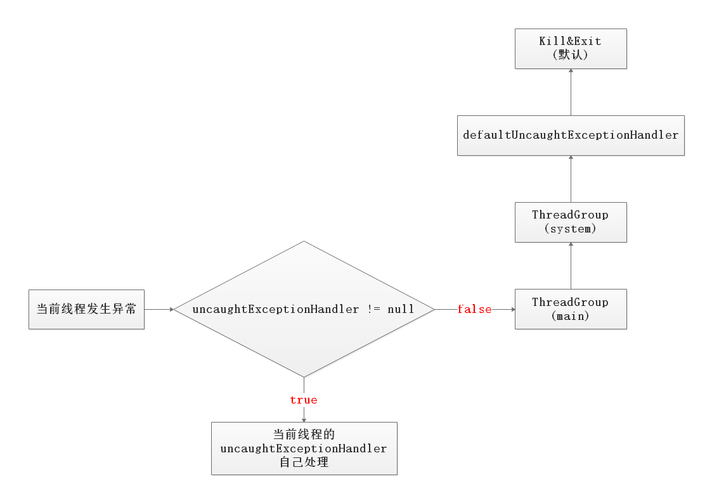
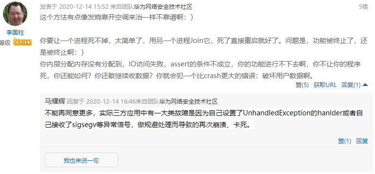

# Android Crash for Java

参考:  
[《Android异常崩溃捕获》](https://www.jianshu.com/p/99212c2e0308)   
[《Java异常及异常处理》](https://www.xiaoheidiannao.com/71139.html)  
[《Framework 源码解析 (8) - UncaughtExceptionHandler 小结》](https://www.jianshu.com/p/5ef4729673c9)  
[《理解Android Crash处理流程》](http://gityuan.com/2016/06/24/app-crash/)  

## 1、Crash介绍
常见的Android崩溃可以粗略的分为两类：**Java Crash**和**Native Crash**。本文主要介绍Java层的异常崩溃。

在Java中，Throwable是所有错误Error和异常Exception的父类。

- ```Checked Exception```：编译器要求必须处置的异常。在方法中要么用```try-catch```语句捕获它并处理，要么用 ```throws``` 子句声明抛出它，否则编译不会通过。

- ```Unchecked Exception```：在编译时，不会提示和发现这样的异常，不要求程序处理这些异常。包括**运行时异常**（```RuntimeException```与其子类）和**错误**（```Error```）。


注：本文代码均以Android 9.0 为例


## 2、Java Crash捕获介绍
从安卓 APP 开发的角度，Java 崩溃捕获相对比较容易，虚拟机给 Java 字节码提供了一个受控的运行环境，同时也提供了完善的 Java 崩溃捕获机制。

### 2.1 注册
Thread中定义了```Thread.UncaughtExceptionHandler``` 接口。
```java
public interface UncaughtExceptionHandler {

    void uncaughtException(Thread t, Throwable e);
}

```

Thread中存在两个UncaughtExceptionHandler字段，一个是**静态的**，另一个是**非静态**。

静态：```defaultUncaughtExceptionHandler```  
静态方法：```public static void setDefaultUncaughtExceptionHandler()```   
当前进程中的任何线程抛出了未捕获Exception，都会被此UncaughtExceptionHandler处理,因此管辖范围为整个进程。

非静态：```uncaughtExceptionHandler```   
实例方法：```public void setUncaughtExceptionHandler()```，即线程私有的。   
为单个线程设置一个属于线程自己的uncaughtExceptionHandler，管辖范围仅限于自己的线程。

**扩展：App在发生Crash的时候，是如何打印日志，如何退出的？**  
App启动时，Android会通过zygote进程fork一个进程，然后执行初始化工作。在初始化的过程中，会执行```RuntimeInit.commonInit();```中的方法：
```java
// /frameworks/base/core/java/com/android/internal/os/RuntimeInit.java

protected static final void commonInit() {
    if (DEBUG) Slog.d(TAG, "Entered RuntimeInit!");

    /*
     * set handlers; these apply to all threads in the VM. Apps can replace
     * the default handler, but not the pre handler.
     */
    LoggingHandler loggingHandler = new LoggingHandler();
    Thread.setUncaughtExceptionPreHandler(loggingHandler);
    Thread.setDefaultUncaughtExceptionHandler(new KillApplicationHandler(loggingHandler));
    // ...略
}

```
在上面的代码中我们可以发现，Android已经为App设置了默认的```UncaughtExceptionHandler```进行异常处理：
- ```LoggingHandler```：用于处理打印日志。
- ```KillApplicationHandler```：调用AMS，弹出“应用异常”的dialog，然后结束进程并退出等等。


### 2.2 分发

当发生未捕获的异常（**没有被```try-catch```的异常**）时，虚拟机会调用当前线程Thread的```dispatchUncaughtException```方法，进行异常分发。

```c
// art/runtime/thread.cc

void Thread::HandleUncaughtExceptions(ScopedObjectAccessAlreadyRunnable& soa) {
  if (!IsExceptionPending()) {
    return;
  }
  ScopedLocalRef<jobject> peer(tlsPtr_.jni_env, soa.AddLocalReference<jobject>(tlsPtr_.opeer));
  ScopedThreadStateChange tsc(this, kNative);

  // Get and clear the exception.
  ScopedLocalRef<jthrowable> exception(tlsPtr_.jni_env, tlsPtr_.jni_env->ExceptionOccurred());
  tlsPtr_.jni_env->ExceptionClear();

  // 调用当前线程的dispatchUncaughtException方法进行分发
  // Call the Thread instance's dispatchUncaughtException(Throwable)
  tlsPtr_.jni_env->CallVoidMethod(peer.get(),
      WellKnownClasses::java_lang_Thread_dispatchUncaughtException,
      exception.get());

  // If the dispatchUncaughtException threw, clear that exception too.
  tlsPtr_.jni_env->ExceptionClear();
}
```
所以，Thread的```dispatchUncaughtException```负责处理异常的分发逻辑。

### 2.2.1 分发过程

1. 首先处理```setUncaughtExceptionPreHandler()```方法注册的异常处理Handler —— 这里的是```LoggingHandler```，负责记录日志（默认，不可修改过）
```java
// java/lang/Thread.java

public final void dispatchUncaughtException(Throwable e) {
    // 上面进行打印日志
    // BEGIN Android-added: uncaughtExceptionPreHandler for use by platform.
    Thread.UncaughtExceptionHandler initialUeh =
            Thread.getUncaughtExceptionPreHandler();
    if (initialUeh != null) {
        try {
            initialUeh.uncaughtException(this, e);
        } catch (RuntimeException | Error ignored) {
            // Throwables thrown by the initial handler are ignored
        }
    }
    // END Android-added: uncaughtExceptionPreHandler for use by platform.
    
    // 然后在这里进行分发和处理
    getUncaughtExceptionHandler().uncaughtException(this, e);
}
```

2. 然后处理线程私有的```uncaughtExceptionHandler```异常处理方法；如果私有Handler不存在，则使用```ThreadGroup```的异常处理方法；
```java
// java/lang/Thread.java

public UncaughtExceptionHandler getUncaughtExceptionHandler() {
    return uncaughtExceptionHandler != null ?
        uncaughtExceptionHandler : group;
}
```

3. ```ThreadGroup```中，优先调用父线程组的处理逻辑，否则，调用**setDefaultUncaughtExceptionHandler()** 方法注册的Handler处理异常。
```java
// java/lang/ThreadGroup.java

public void uncaughtException(Thread t, Throwable e) {
    if (parent != null) {
        parent.uncaughtException(t, e);
    } else {
        Thread.UncaughtExceptionHandler ueh = Thread.getDefaultUncaughtExceptionHandler();
        if (ueh != null) {
            ueh.uncaughtException(t, e);
        } else if (!(e instanceof ThreadDeath)) {
            System.err.print("Exception in thread \"" + t.getName() + "\" ");
            e.printStackTrace(System.err);
        }
    }
}
```
流程图如下：


### 2.3 处理
Android已经为App设置了默认的```UncaughtExceptionHandler```进行异常处理：
- ```LoggingHandler```：用于打印日志。
- ```KillApplicationHandler```：调用AMS，弹出“应用异常”的dialog，结束进程并退出等等。

关键代码如下：
```java
// /frameworks/base/core/java/com/android/internal/os/RuntimeInit.java

private static class KillApplicationHandler implements Thread.UncaughtExceptionHandler {
    // ...略
    @Override
    public void uncaughtException(Thread t, Throwable e) {
        try {
            
            // ...略
            // 调用AMS，弹出crash dialog，详细过程可以去ActivityManagerService.java中去看
            // 但是现在有很多厂商在系统层屏蔽了这个页面，因此表现为闪退。（反正自己写的demo没弹出这个dialog）
            // Bring up crash dialog, wait for it to be dismissed
            ActivityManager.getService().handleApplicationCrash(
                    mApplicationObject, new ApplicationErrorReport.ParcelableCrashInfo(e));
        } catch (Throwable t2) {
            // ...略
        } finally {
            // 杀死进程并退出
            // Try everything to make sure this process goes away.
            Process.killProcess(Process.myPid());
            System.exit(10);
        }
    }
}

```
系统默认异常处理逻辑在```KillApplicationHandler```类的```uncaughtException()```方法中，系统默认Crash弹框等逻辑是通过AMS的```handleApplicationCrash()```方法执行的。


## 3、FAQ

### 3.1 设置了```Thread.setDefaultUncaughtExceptionHandler```之后，APP就不会崩溃了吗

设置```UncaughtExceptionHandler```不等于给App穿上大号的```try-catch```。  
```UncaughtExceptionHandler```只是**一种提醒开发者发生了未捕获的异常的一种手段**。开发者可以在此基础上做一些记录和上报的动作等等。但并不能当什么事情也没有发生一样，让程序继续执行。  
以Android主线程为例。Android主线程本质上就是一个由Looper开启的死循环，然后不断的处理MessageQueue中的Message。  
这个模型可以简化为：
```java
public static void loop() {
    for (;;) {
        // 取Msg，阻塞调用
	    Message msg = queue.next(); 
	    if (msg == null) {
	    	// 结束退出
	    	return;
	    }
        // 分发处理
	    msg.target.dispatchMessage(msg);
    }
}
```

当发生未捕获异常时，也就是Looper处理某一个Message发生了异常，然后跳出了死循环，所以后续 Message 是无法正常派发的。所以此时的现象就是整个App卡住不动，无法响应任何输入或者点击事件。当然，我们也是有各种办法让这个looper重新开始循环，让App继续正常运行。但这些方法就像“发烧靠开空调来治病”一样，不靠谱。
  
因此，可以在```defaultUncaughtExceptionHandler```中做了**记录后再推给默认exceptionHandler**或者**退出App**。  


推荐阅读：    
[《能否让APP永不崩溃—小光与我的对决》](https://juejin.cn/post/6904283635856179214)  
[《应用防crash方案研究》](http://3ms.xxxx.com/km/blogs/details/9138439)  


### 3.2 Android SDK 与JDK的关系
参考：  
[《Android SDK与JDK区别和联系》](https://www.javatt.com/p/57226)   
[《一分钟认识JAVA与Android的联系与区别》](https://www.omegaxyz.com/2017/08/02/onemtolearnandroidandjava/)   

Android上的应用大多数是用JAVA开发的，但是Android SDK引用了大部分的Java SDK，少数部分被Android SDK抛弃。  

1. Android SDK基本包含rt.jar基础类库但是并不全部包括，剔除了rt.jar的部分基础类
2. Android SDK不包括虚拟机但JDK包括虚拟机，Android的Darvit虚拟机安装在Android设备上
3. Android SDK和JDK编译工具都是将java文件编译成各自虚拟机能够识别的编码

### 3.3 Thread与ThreadGroup


### 3.4 @hide注解的作用


### 3.5 Android是如何实现在 App 发生Crash时的弹窗提示的？


### 3.6 注册顺序问题：
注：```setDefaultUncaughtExceptionHandler```方法和```setUncaughtExceptionHandler```方法有注册顺序的问题。对一个接口进行多次注册后，只有最后一次生效。


### 3.7 执行线程问题（当前线程发生崩溃时，执行```uncaughtException()```方法的是哪一个线程？）

当发生未捕获异常时，调用```UncaughtExceptionHandler```的线程，就是发生异常的线程。该函数```uncaughtException()```的入参```Thread t```，就是发生异常的线程自己。  
这一点可以从```Thread#dispatchUncaughtException()```方法中看到：调用```uncaughtException()```方法时传递的是```this```。   


