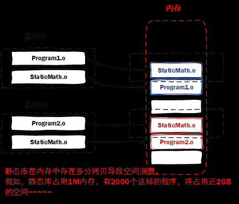
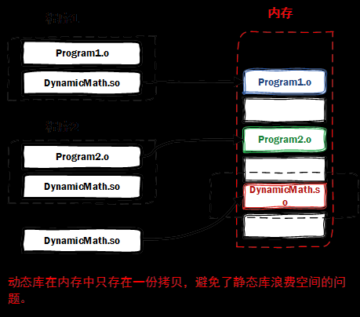
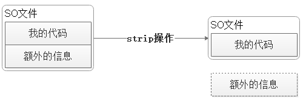
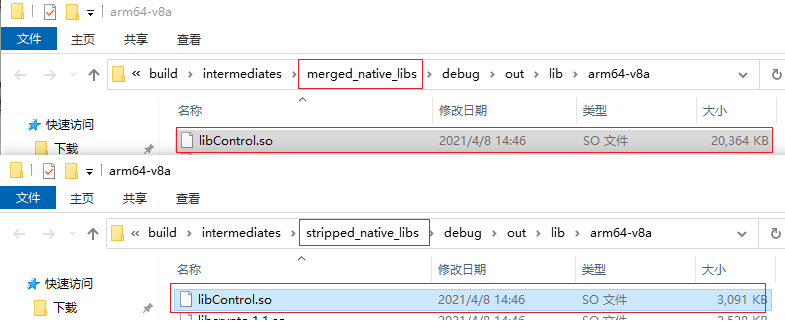
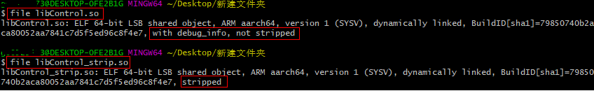

# Android Crash for Native

参考：  
[《Linux的so文件到底是干嘛的？浅析Linux的动态链接库》](https://zhuanlan.zhihu.com/p/235551437)  
[《Android NativeCrash 捕获与解析》](https://segmentfault.com/a/1190000039273568)  
[《Android Native Crash 收集》](https://www.kymjs.com/code/2018/08/22/01/)  
[《静态库与共享库》](https://www.huaweicloud.com/articles/f5029dd22c8a7d11e0ef33463ac31b84.html)    
[《C++静态库与动态库》](https://www.runoob.com/w3cnote/cpp-static-library-and-dynamic-library.html)   
[《iqiyi/xCrash》](https://github.com/iqiyi/xCrash)  

## Native Crash捕获介绍

相比于Java层的崩溃来说，Native层的崩溃捕获和处理相对比较困难。  
安卓系统的debuggerd 守护进程会为 native 崩溃自动生成详细的崩溃描述文件（tombstone）。在开发调试阶段，可以通过系统提供的 bugreport 工具获取 tombstone 文件（或者将设备 root 后也可以拿到）。  
但是对于发布到线上的安卓 APP，如何获取 tombstone 文件，安卓操作系统本身并没有提供这样的功能。这个问题一直是Android端 native 崩溃分析的痛点之一。


## 1、so的基础知识

### 1.1 ```.o```文件、```.a```文件和```.so```文件
- ```.o```文件  
c++源文件经过编译得到的**目标文件（Object File）**，是一些**编译后但是还未链接**的二进制机器码文件。  
命令：```gcc -c xxx.c```  
我们常用的**第三方库**其实就是其他人编译打包好的目标文件，这些库里面包含了一些函数，我们可以直接调用而不用自己动手实现一遍。  

- ```.a```文件是**静态库文件**    
Linux静态库命名规范，必须是```lib[your_library_name].a```：```lib```为前缀，中间是静态库名，扩展名为```.a```。   
命令：```ar -r libadd.a add.o```    
静态链接的方式，就是在链接阶段将**所需的目标文件与其引用到的库**打包到一起。   
优点：编译后的执行程序不需要外部的函数库支持。  
缺点：利用静态函数库编译成的**文件比较大**。因为整个函数库的所有数据都会被整合进目标代码中。如果静态函数库改变了,那么你的程序必须重新编译。  


- ```.so```文件是**共享库文件（或动态库文件，Shared Object File）**，即动态链接库文件  
Linux动态链接库命名规范，必须是 ```lib[your_library_name].so```，```lib```为前缀，中间是动态库名，扩展名为```.so```。   
命令：```gcc -shared xxx.c -o libxxx.so```   
是一种ELF格式的文件。共享库文件在编译的时候，并没有将其他目标文件编译进来。因此使用动态链接的方式所产生的可执行**文件比较小**。在程序运行时才将那些库装载（Load，装载是指将磁盘上的程序和数据加载到内存上）进来。所以**不同的应用程序如果调用相同的库，那么在内存里只需要有一份该共享库的实例**，规避了空间浪费问题，同时也支持程序的增量更新。   
优点：每个可执行文件都更小。  
缺点：如果将一份目标文件移植到一个新的操作系统上，而新的操作系统缺少相应的共享库，程序将无法运行，必须在操作系统上安装好相应的库才行。  


- ```.out```

TODO：附上一个编译出来的 .o .a .so 文件的例子


### 1.2 so文件的组成

一个完整的 so 由“代码信息”和一些“额外信息”，这些其他信息包括调试信息和符号信息。所以，未处理的so通常体积会比较大。
在开发阶段，这些额外的信息可以很方便的辅助我们定位问题。但发布时，往往需要经过strip操作，将这些额外的信息去除掉。这样strip之后的 so 中的debug信息会被剥离，整个 so 的体积也会缩小。



使用Android Studio编译时，默认都会同时编译出strip和未strip的so文件。他们存在的路径一般在：  
- strip之前：```build\intermediates\merged_native_libs``` 目录   
- strip之后：```build\intermediates\stripped_native_libs``` 目录  

以实际项目中的一个so为例：strip前体积是20M左右，strip后体积仅为3M左右。如下图：  
   

这些“额外信息”也是有一定作用的。它可以类比于java混淆代码过程中的mapping文件：只有拥有这个mapping文件，**才能在发生异常时对堆栈信息进行恢复和分析**。  
如果这些信息丢了，那么就很难还原堆栈信息，也就很难定位问题。 所以，这些额外的信息尤为重要，是我们分析Crash问题的关键信息。所以我们在编译 so 时候务必保留一份未被strip的so 或者剥离后的符号表信息，以供后面问题分析。并且每次编译so 都需要保存这些“额外信息”。因为一旦代码修改后重新编译，那么修改前后的符号表信息会无法对应，也无法进行分析。

另外，我们也可以通过Android SDK提供的工具```aarch64-linux-android-strip```手动进行strip。该工具所在路径在：```androidSDK路径\ndk\版本号\toolchains```。具体使用方法不在此处详细介绍了。

### 1.3 查看 so 状态
1. 使用 file 命令可以查看 so 的状态和一些基本信息。
```bash
file libxxx.so
```


如上图所示，```with debug_info, not stripped```代表携带debug信息的so，```stripped```代表是没有debug信息的so

2. 通过```nm```命令， 可以读出```libxxx.so```中的符号信息

```bash
nm libxxx.so > tmp
```
如果so已经执行了strip操作，那么实行上述命令就会提示。
```bash
nm: libxxx.so: no symbols
```

## 2、监听Native Crash事件

与 Java 平台不同，C/C++ 没有一个通用的异常处理接口。在 C/C++ 层，CPU 通过异常中断的方式，触发异常处理流程。linux 把这些中断处理，统一为信号量：每一种异常都有一个对应的信号。
因此，捕获Native Crash的核心思想就是**注册回调函数来处理需要关注的信号量**。

### 2.1 信号量
所有的信号量都定义在```<signal.h>```文件中。可以查阅相关资料了解每个信号的含义。
通常我们在做 crash 收集的时候，主要关注这几个信号量：
```C
typedef struct
{
    int              signum;
    struct sigaction oldact;
} rcc_signal_crash_info_t;

static rcc_signal_crash_info_t rcc_signal_crash_info[] =
{
    {.signum = SIGABRT},    // 调用abort函数生成的信号，表示程序异常
    {.signum = SIGBUS},     // 非法地址，包括内存地址对齐出错，比如访问一个4字节的整数, 但其地址不是4的倍数
    {.signum = SIGFPE},     // 计算错误，比如除0、溢出
    {.signum = SIGILL},     // 执行了非法指令，或者试图执行数据段，堆栈溢出
    {.signum = SIGSEGV},    // 非法内存操作，与SIGBUS不同，他是对合法地址的非法访问，比如访问没有读权限的内存，向没有写权限的地址写数据
    {.signum = SIGTRAP},    // 断点时产生，由debugger使用
    {.signum = SIGSYS},     // 非法的系统调用
    {.signum = SIGSTKFLT}   // 协处理器堆栈错误
};
```
### 2.2 注册信号操作函数
```c
int sigaction(int __signal, const struct sigaction* __new_action, struct sigaction* __old_action)
```
上述函数会依参数 ```__signal``` 指定的信号编号来设置该信号的处理函数。   
参数：   
- ```__signal```: 第一个参数 int 类型，表示需要关注的信号量
- ```__new_action```: 第二个参数 ```sigaction``` 结构体指针，用于声明当某个特定信号发生的时候，应该如何处理。
- ```__old_action```: 第三个参数也是 ```sigaction``` 结构体指针，他表示的是默认处理方式，当我们自定义了信号量处理的时候，用他存储之前默认的处理方式。

所以，要监听异常发生时的信号，最简单的做法就是直接**用一个循环遍历所有要订阅的信号**，即对每个信号调用```sigaction()```
```C
for(i = 0; i < 8; i++){
    sigaction(rcc_signal_crash_info[i].signum, &act, &(rcc_signal_crash_info[i].oldact));
}
```

### 2.3 捕获Native Crash事件
在上述函数中用到了结构体```sigaction```。该结构体有一个 ```sa_sigaction```变量：这是一个函数指针，原型为：```void (*)(int siginfo_t *, void *)```。因此，我们可以声明一个函数，直接将函数的地址赋值给```sa_sigaction```。
```C
// 1、定义 Native Crash处理函数
void rc_crash_signal_handler(int sig, siginfo_t *si, void *uc){
    // 略...
}
```

```C
struct sigaction act;
// 2、sigaction指向处理函数
act.sa_sigaction = rc_crash_signal_handler;
act.sa_flags = SA_RESTART | SA_SIGINFO | SA_ONSTACK;

// 3、注册
for(i = 0; i < 8; i++){
    sigaction(rcc_signal_crash_info[i].signum, &act, &(rcc_signal_crash_info[i].oldact));
}
```

### 2.4 后序工作
当发生 Native Crash 时，就会调用我们传入的```rc_crash_signal_handler()```函数。
在这里，我们同样需要做很多事情，比如捕获出问题的代码、导出堆栈信息、写入文件、上报服务器或回调给Java等等。
最麻烦的应该算是“如何导出导出堆栈信息”了。
开源库：```libunwind```,```coffeecatch```,```breakpad```等等


## 3、FAQ


常用的Crash捕获SDK介绍：移动平台崩溃收集分析系统对比：友盟、Bugly、华为AGC


