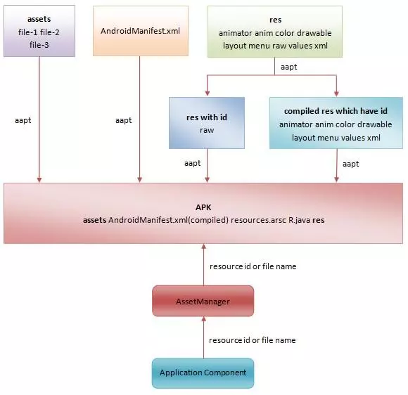

## 1. Android存储的文件夹

- 内部存储
-	外部存储（SD卡）
	- 自定义目录（卸载App后依然存在）
	- 应用程序目录（卸载App后一并被删除）
**这种划分方式比较陈旧了，需要再验证**

```java
Log.e(TAG, "内部存储路径--------");
Log.e(TAG, "获取根路径 \t" + Environment.getDataDirectory());		// /data
Log.e(TAG, "获取应用程序路径 \t" + getFilesDir().getParent());		// /data/user/0/com.example.myapp
Log.e(TAG, "获取文件路径\t" + getFilesDir());											// /data/user/0/包名/files
Log.e(TAG, "获取缓存路径\t" + getCacheDir());											// /data/user/0/包名/cache		
Log.e(TAG, "在data文件夹下创建指定名称的file\t"+getFileStreamPath("MyFile").getAbsolutePath());     // /data/user/0/com.example.myapp/files/MyFile
Log.e(TAG, "获取或创建指定文件夹\t" + getDir("MyDir", Context.MODE_PRIVATE).getAbsolutePath());     //获得（如果没有就创建）一个目录在 /data/user/0/com.example.myapp/app_MyDir
 

Log.e(TAG, "外部存储路径--------");
Log.e(TAG, "外部存储状态是否可用：" + hasSdCardMounted());											//	/storage/emulated/0
Log.e(TAG, "获取根路径\t" + Environment.getExternalStorageDirectory());			//	/storage/emulated/0/Android/data/com.example.myapp
Log.e(TAG, "获取应用程序路径 \t" + getExternalFilesDir(null).getParent());		//	/storage/emulated/0/Android/data/com.example.myapp
Log.e(TAG, "获取文件路径\t" + getExternalFilesDir(null));						//	/storage/emulated/0/Android/data/com.example.myapp
Log.e(TAG, "获取缓存路径\t" + getExternalCacheDir());							//	/storage/emulated/0/Android/data/com.example.myapp


//读取assets文件夹下的文件
context.getAssets().open("fileName");

```
**"/data/user/0/" 与 "/data/data/" 本质是一样的，只是不同手机的型号不同而已**
**"/storage/emulated/0/"则是外挂SD卡的位置**

**即使是不同模块，也都是相同的 “com.example.myapp” ？？这是为什么？？或者说这个名字是如何确定的**

-----------

## 2. AndroidManifest.xml文件
Android 系统里有一个名为 AndroidManifest.xml的文件，它里面注册了 App 的所有组件信息，可以把它当做一个清单或者索引表。
应用程序中所有的组件都需要提前注册在这个文件中，并且描述组件的名称、启动模式等信息。
在系统启动应用程序后，系统会根据这个文件的组件名称来查找组件，查找到对应组件之后才会执行启动操作。
否则会抛出组件未找到的错误。


### directBootAware属性：
> https://www.jianshu.com/p/6198568d56a7
在manifest文件中的ContentProvider组件中添加。
设备启动后进入的一个新模式，直到用户解锁（unlock）设备此阶段结束。

### metadata
元数据，供父组件使用的键值对（name-value）
```xml
<meta-data android:name="string"
           android:resource="resource specification"
           android:value="xiaoming" />
```
- android:name		分配给该标签的键，即唯一名称。为确保名称唯一应使用Java风格命名约定，如“com.example.project.activity.fred”
- android:resource		对资源的引用，如“@string/app_name”。该资源ID可以通过该metaData.getInt()方法获取
- android:value		分配给该标签的值，如String、Boolean等

**应用场景举例**：
我们接入第三方SDK时，SDK可以在读取这些metadata，实现对来源的信息进行标记，进而做出不同的动作。

--------
## 3. Apk文件


### apk文件的组成
- classes.dex ：android vm 字节码
- res ：drawable、layout的二进制
- resource.arsc :  id、字符串等字符流相关内容
- META-INF : 签名信息
- AndroidManifest.xml：组件清单
- assets ：不参与编译的二进制文件（这个路径下的文件会被压缩吗）

apk本身是一个压缩包

**这个在哪里？**
- R.java 文件保存的是所有资源的 ID 常量值

### apk签名 V1和V2的区别

- v1：也就是“JAR 签名”，不保护 APK 的某些部分，例如 ZIP 元数据

- v2： v2 是一种全文件签名方案，在 Android 7.0 中引入的。该方案会对 APK 的内容进行哈希处理和签名，然后将生成的“APK 签名分块”插入到 APK 中。

- v3：在Android 9.0中，v2升级为v3。主要在签名分块中增加了其他信息

**为了最大限度地提高兼容性，请按照 v1、v2、v3 的先后顺序采用所有方案对应用进行签名。7.0及以上会拒绝v1签名，7.0以下的系统会忽略 v2+ 签名（会直接忽略添加到 APK 的额外数据，这就需要应用包含 v1 签名）。**

### split APK


----------------
## 4. APK文件与资源打包过程分析
参考：
> https://www.jianshu.com/p/3cc131db2002
> https://www.jianshu.com/p/85c8ce13fcad

APK文件解压后主要包括以下文件：
```
apk
 |
 |- res/
 |- META-INF/
 |- classes.dex
 |- classes2.dex
 |- AndroidManifest.xml
 |- resources.arsc

```
主要的几个部分：
- AndroidManifest.xml:包括声明的四大组件和申请的权限。作用类似于一个全局的注册表
- classes.dex：Android平台上的可执行文件
- META_INF:签名文件夹，包括签名和公钥证书等
- res:资源文件夹，和咱们开发中使用的res是同一个东西
- resources.arsc
- lib:存放的是so动态链接库，so动态链接库是不需要做处理apk打包一些压缩处理的。

补充几个工具：
- appt：Android资源打包工具
- javac：


### 4.1 打包过程
> https://developer.android.com/studio/build?hl=zh-cn (官方文档)

- 除了assets和res/raw资源被原封不动地打包进APK之外，其它的资源都会被编译或者处理。（xml文件会被编译为**二进制的xml**，所以解压apk后，无法直接打开xml文件）
- 除了assets资源之外，其他的资源都会被赋予一个资源ID。
- 打包工具负责编译和打包资源，编译完成之后，会生成一个resources.arsc文件和一个R.java，前者保存的是一个资源索引表，后者源。
- 应用程序配置文件AndroidManifest.xml同样会被编译成二进制的XML文件，然后再打包到APK里面去。
- 应用程序在运行时最终是通过AssetManager来访问资源，或通过资源ID来访问，或通过文件名来访问

总的来说，就如图所示：

**总的来说：在生成的apk中，只有assets和res/raw资源被原装不动地打包进apk。其它的资源都会被编译或者处理。**

### 4.2 R文件与resources.arsc文件：
```java
R.id.xxxx
R.layout.xxx
R.color.xxx
```

- R.java定义了各个资源ID常量，供在代码中索引资。里面的id值不重复。
- resources.arsc是清单文件，是程序在运行时候用到的资源索引表。
- R.java是给程序员读的，resources.arsc是给机器读的。

**问题：不同分辨率的文件夹（比如drawable-xdpi或者drawable-xxdpi）存放的图片和名称和id是一样的，在运行的时候是怎么根据设备的分别率来选择对应的分辨率的图片？**
这时候就需要resources.arsc这个文件了，resources.arsc里面会对所有的资源id进行组装，在apk运行是会根据设备的情况来采用不同的资源。resource.arsc文件的作用就是通过一样的ID，根据不同的配置索引到最佳的资源现在UI中。

### 4.3 资源固定
资源id的固定在热修复和插件化中极其重要。
- 在热修复中，构建patch时，需要保持patch包的资源id和基线包的资源id一致；
- 在插件化中，如果插件需要引用宿主的资源，则需要将宿主的资源id进行固定。
因此，资源id的固定在这两种场景下是尤为重要的。


-----------
## 5. bundletool（Google原版）
> https://developer.android.com/studio/command-line/bundletool

```bash
bundletool build-apks

参数：
#必需
–bundle：指向上一步生成的aab文件

–output：指向输出apks文件

#可选

#签名——指向签名文件：如果不指定，就默认使用debug key
--ks=/MyApp/keystore.jks
--ks-pass=file:/MyApp/keystore.pwd
--ks-key-alias=MyKeyAlias
--key-pass=file:/MyApp/key.pwd

```

-----------
## 6. ADB命令

```bash
# 安装apk
 adb install app-debug.apk

# 查看设备列表
 adb devices

# 在连接多设备的时候选择其中某一个设备操作
 adb -s <设备序号>

# 将logcat日志导出到文件
 adb logcat -v threadtime > logcat.log

 adb install-multiple base-master.apk base-arm64_v8a.apk base-xxxhdpi.apk

# 关闭Selinux
adb shell setenforce 0  

# 重启
adb reboot

#'adb remount' 将 '/system' 部分置于可写入的模式，默认情况下 '/system' 部分是只读模式的。这个命令只适用于已被 root 的设备。
#在将文件 push 到 '/system' 文件夹之前，必须先输入命令 'adb remount'。
#'adb remount' 的作用相当于 'adb shell mount -o rw,remount,rw /system'。
adb remount

# adb shell里面进行操作
dumpsys package com.example.myapp

# 不同版本的手机HiSpace的路径还不一样
cd /system/priv-app/HiSpace/
cd /system/priv-app/HMS

 mv HiSpace.apk HiSpace.apk.bak
 mv HMS.apk HMS.apk.bak
# oat是啥文件
rm -rf oat


# 查看已安装的apk的安装位置
pm list packages -f |grep chan
dumpsys package com.xxx.xxid | grep codePath
dumpsys package com.example.myapp | grep codePath
# 例如： 
# package:/data/app/com.chan.aab-cdRBXV-XYstohnxCQB9L3Q==/base.apk=com.chan.aab
# package:/system/priv-app/Exchange2/Exchange2.apk=com.android.exchange


# push & pull
adb push <本地地址> <远端（手机）地址>
adb pull <远端（手机）地址> <本地地址>

# 输入文本text到view中
adb shell input text xxxx

```

-------------------
## 7. APK的包名
在project中的build.gradle文件中，**applicationId** 字段表示的值表示app的包名。
> https://developer.android.com/studio/build/application-id

```java
android{
    ...

    defaultConfig{
        ...
        applicationId 'com.xxx.xxx'
    }
}
```
注意：
1. ```AndroidManifest.xml```文件中的package并非包名，而是指定了**各个组件（Activity，Service等）和资源**的父路径**
2. 如果gradle中不指定applicationId，则使用```AndroidManifest.xml```文件中的值。此时app的包名和app内各个组件的父路径同名。
3. 通过gradle修改app为任意包名，不影响最终生成的```AndroidManifest.xml```文件中各个组件的name（即全路径）

---------------

## 8. locale语言
```java
// 根据各种形式的language值进行格式化，得到Locale对象
Locale locale = Locale.forLanguageTag("fr-FR");

//获取language值（不带国家码）
String language = locale.getLanguage();

// 获取languageTag
String languageTag = locale.toLanguageTag();

```


为兼容Android系统的多个版本，获取当前的系统的语言信息locale。故提供以下代码供开发者参考。
```java
    public static Set<String> getDeviceLanguageTags(Context context) {
        Set<String> languageTags = new HashSet<>();
        if (Build.VERSION.SDK_INT >= Build.VERSION_CODES.N) {
            LocaleList localeList = context.getResources().getConfiguration().getLocales();
            for (int i = 0; i < localeList.size(); i++) {
                languageTags.add(Locale.forLanguageTag(localeList.get(i).getLanguage()).getLanguage());
            }

        } else if (Build.VERSION.SDK_INT >= Build.VERSION_CODES.LOLLIPOP) {
            Locale currentLocal = context.getResources().getConfiguration().locale;
            languageTags.add(Locale.forLanguageTag(currentLocal.getLanguage()).getLanguage());

        } else if (Build.VERSION.SDK_INT >= Build.VERSION_CODES.JELLY_BEAN) {
            languageTags.add(Locale.getDefault().getLanguage());
            Log.d(TAG, "the languageTags:" + Locale.getDefault().getLanguage());

        }
        return languageTags;
    }
```

## 9、低版本Android运行Java 8 的语言特性
> https://developer.android.com/studio/write/java8-support
Android Gradle 插件 3.0.0 及更高版本支持所有 Java 7 语言功能，以及部分 Java 8 语言功能（具体因平台版本而异）。
使用 Android Gradle 插件 4.0.0 及更高版本构建应用时，您可以使用多种 Java 8 语言 API，而无需为应用设置最低 API 级别。

因为 Android Gradle 插件 对API进行了脱糖处理


## 10、Android访问权限

1. apk下载到cache目录，只有 ```rw``` 权限，没有 ```x``` 权限，所以无法安装
使用```Runtime.getRuntime().exec()```，执行 ```chmod``` 命令，修改为 ```rwx```

未解决

--------
## 11、注解：

- @TargetApi
```Java
@TargetApi
public void finction(){

}
```

- @Hide
```java
	/*
    * @hide
     */
    public AssetManager() {}

```
- @RequiresApi与@TargetApi
使用
```java
@RequiresApi(api = Build.VERSION_CODES.LOLLIPOP)

@android.support.annotation.RequiresApi(api = Build.VERSION_CODES.LOLLIPOP)

@TargetApi(Build.VERSION_CODES.LOLLIPOP)
```
当你使用一个较高版本才有的api（比工程中的minSdkVersion高)时，编译器会报错，@TargetApi和@RequiresApi可以让代码编译通过。
注意：这两个注解的作用仅仅是让编译通过，而并没有避免低版本的系统运行高版本的api的问题，在使用时我们需要自己判断版本号来使用不同的api。


```Closeable```使用


## 12、工具
Systrace工具：
分析UI渲染时长的工具


