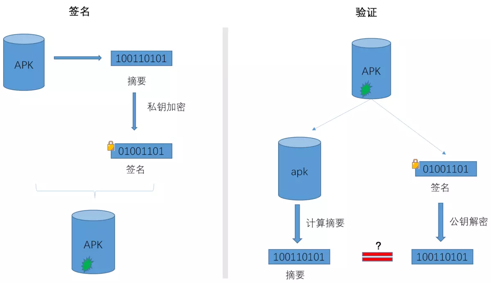
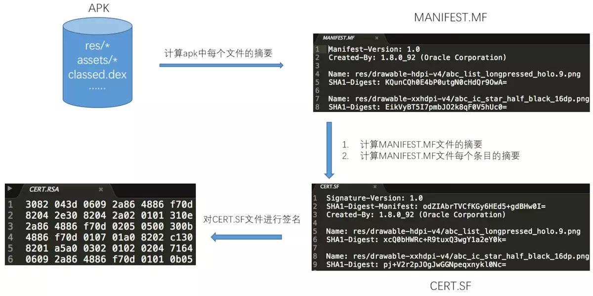
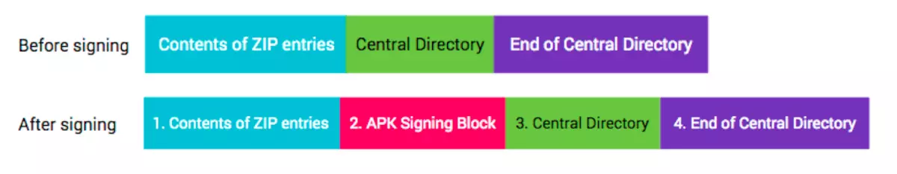

# APK签名基础知识

## 签名与校验原理
>参考 
[APK签名机制原理详解](https://www.jianshu.com/p/286d2b372334)
[APK签名机制之——JAR签名机制详解](https://www.jianshu.com/p/682bb351099f)
[APK签名机制之——V2签名机制详解](https://www.jianshu.com/p/308515c94dc6)
[Goole官方文档——应用签名](https://source.android.com/security/apksigning)
[apksigner工具使用](https://developer.android.com/studio/command-line/apksigner)

## 签名和校验过程如图所示：


这里有一个前提：接收方必须要知道发送方的公钥和所使用的算法。如果数字签名和公钥一起被篡改，接收方无法得知，还是会校验通过。如何保证公钥的可靠性呢？答案是数字证书，数字证书是CA颁发的。 需要注意的是，Apk的证书通常的自签名的，也就是由开发者自己制作，没有向CA机构申请。**Android在安装Apk时并没有校验证书本身的合法性**，只是从证书中提取公钥和加密算法，这也正是对第三方Apk重新签名后，还能够继续在没有安装这个Apk的系统中继续安装的原因。


------
## V1签名——Jar Signature

基于 JAR 签名：对apk(或者压缩包)中单个文件签名验证，解压后可以重新压缩

### 使用V1签名的apk包文件的目录格式
```bash
app.apk
    |
    |--META-INF
    |       |--CERT.RSA
    |       |--CERT.SF
    |       |--MANIFEST.MF
    |--res
    |--AndroidManifest.xml
    |--classes.dex
    |--resources.arsc
```
**META-INF目录中的三个文件与签名有关。**
- MANIFEST.MF文件：
记录了apk中所有文件（v1包括什么？v2包括什么？）的摘要信息。
其中摘要信息采用BASE64编码
- CERT.SF文件：
记录了MANIFEST.MF文件和MANIFEST.MF文件中每个item的摘要信息。
其中摘要信息采用BASE64编码
- CERT.RSA文件
里面保存了签名者的证书信息

具体签名过程：


### 篡改与重签
1. 篡改apk内容
校验apk中每个文件的完整性时失败；如果是添加新文件，因为此文件的hash值在.mf和.sf中无记录，同样校验失败；

2. 篡改apk内容，同时篡改manifest.mf文件相应的摘要
校验manifest.mf文件的摘要会失败；

3. 篡改apk内容，同时篡改manifest.mf文件相应的摘要，以及cert.sf文件的内容
校验cert.sf文件的签名会失败；

4. **把apk内容和签名信息一同全部篡改**
**这相当于对apk进行了V1重新签名**，在此apk没有安装到系统中的情况下，是可以正常安装的，这相当于是一个新的app；但如果进行覆盖安装，则证书不一证，安装失败

### V1签名的劣势
1. 签名校验速度慢
校验过程中需要对apk中所有文件进行摘要计算，在apk资源很多、性能较差的机器上签名校验会花费较长时间，导致安装速度慢；

2. 只保证了APK内各文件的完整性，APK（zip包）其它内容的完整性未保证。
META-INF目录用来存放签名，自然此目录本身是不计入签名校验过程的，可以随意在这个目录中添加文件。比如一些快速批量打包方案就选择在这个目录中添加渠道文件？？？

---------

## V2签名——Full APK Signature
Android 7.0 中引入，在apk中没有发现签名文件，V2签名是对整个APK文件签名验证。解压后重新压缩会导致签名失效。
一个zip格式的文件主要包括三部分：数据区、中央目录、中央目录结尾记录。
V2方案为加强数据完整性保证，不在“数据区”和“中央目录中”插入数据，选择在 “数据区”和“中央目录中” 之间插入一个“APK签名分块”。


**注意：**
1. 在V1+V2的签名方式中，必选先进行V1签名，在进行V2签名
2. 在Android 7.0以上会优先验证V2签名，如果验证通过，则执行安装（不用再校验V1签名）；反之，则不行。
3. 在Android 7.0以下版本中，系统会忽略 v2 签名，仅验证 v1 签名。

### 优点：
1. 签名速度快
2. 保证了apk内文件和apk（zip）包的完整性

## V3签名（V2+）
Android 9.0 中引入

-----
## 常用方法与命令

### V1签名没有计算哪些文件的摘要，V2签名计算了整个apk的摘要？

### 配置签名方式
gradle默认采用v1+v2的方式进行签名。如果想选择签名方式，可以在build.gradle中进行配置：
```java
android {
    signingConfigs {
        release {
            ......
            // v1SigningEnabled false
            v2SigningEnabled false
        }
    }
}
```

### 查看Apk的签名是V1还是V2
- 只有V1签名
在apk中 META-INF/CRET.SF 中开头没有 X-Android-APK-Signed 属性

- V1+V2签名
在apk中 META-INF/CRET.SF 中开头有 X-Android-APK-Signed:2 属性

- 只有V2签名
？？？
如何做到只签v2不签v1，而且apksigner分析后不出错

### 查看APK的签名证书信息
- 对于通过V1签名的apk，解压后得到META-INF/CERT.RSA文件
```bash
# 查看签名证书信息
keytool -printcert -file CERT.RSA
# 查看秘钥库jks
keytool -list -v -keystore 密钥库名
# 参数:
# -list 查看密钥列表
# -v    查看密钥详情
```
- 对于通过V2签名的apk
```bash
java -jar apksigner.jar verify -v --print-certs app-release.apk

java -jar apksigner.jar verify -v app-release.apk
```


