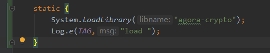
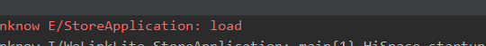
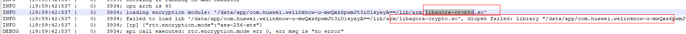

## android:extractNativeLibs

### 1、 介绍：
[官方介绍](https://developer.android.com/guide/topics/manifest/application-element#extractNativeLibs)
[gradle plugin 对extractNativeLibs特性的支持](https://developer.android.google.cn/studio/releases/gradle-plugin#2-2-0)
[gradle plugin 修改extractNativeLibs的默认值](https://developer.android.google.cn/studio/releases/gradle-plugin)

### 2、背景：
默认情况下，so文件会压缩到apk中。当安装时，apk会将so解压出来到data目录下（解压到 ```data/app/包名/lib/arm/``` ，同时也建立了软连接到 ```data/data/包名/lib/``` ），然后再加载。这样同一个so就会存在两份（**一份在apk中，一份在data目录下**）。

**extractNativeLibs设置为false后，so文件就不会被解压，而是在运行时直接从 APK 加载so库。**

### 3、注意事项：
#### 3.1 so在apk中应该是**未压缩的**。

可以通过如下配置进行设置
```java
aaptOptions {
    noCompress 'so'
}
```
**实测发现，extractNativeLibs=true后，不设置该选项也是不压缩的。**

#### 3.2 用 zipalign -p 4来apk中的**so文件对齐** ()

>zipalign官方介绍 https://developer.android.com/studio/command-line/zipalign

```java
buildTypes {
	debug {
		zipAlignEnabled true
	}
	release {
		zipAlignEnabled true
	}
}
```
**实测发现，即使不增加该配置，构建出来的apk中的so文件也是对齐的。**

**从上面官方介绍来看，gradle plugin 在2.2.0版本引入该特性，并且压缩和对齐两个特性无需手动配置。在gradle plugin 3.6.0版本开始，extractNativeLibs默认为false。**

-----------

### 4 记一次增加```extractNativeLibs="false"```后的debug过程
#### 4.1 背景：
在某 app项目开发中，会议组件用到了 ShengWang 的sdk提供的音视频功能。其中，项目组在完成某个需求时，需要调用 ShengWang sdk对音视频流进行加密。因此，便引入了ShengWang提供的```libagora-crypto.so```库文件。

#### 4.2 起因：
该项目为了降低apk预制到设备中占用的空间，开启```android:extractNativeLibs="false"```设置后，导致加密功能不可用。初步定位为```libagora-crypto.so```没有加载和调用。

#### 4.3 经过：
1. 检查so是否被压缩 -- 结果：未压缩，问题依然存在
2. 使用zipalign工具对apk进行对齐 -- 结果：已对齐，问题依然存在
3. 使用zipAlignEnabled设置进行对齐 -- 结果：已对齐，问题依然存在

#### 4.4 突破：
在相同条件下，```libagora-rtc-sdk.so```加载和运行正常，但```libagora-crypto.so```运行时失效。因此，需要分析这两个so库的差异。
1. 反编译sdk，检查其是如何加载so的。发现，在 ShengWang sdk中，只有一个地方加载了so库
```java
System.loadLibrary("agora-rtc-sdk");
```
2. 同时，在root手机中，手动将```libagora-crypto.so```文件push到data目录中，发现sdk的加密功能正常了

**因此，猜想 ShengWang sdk只加载了```libagora-rtc-sdk.so```这一个so库，然后其他so库需要解压到到指定目录（data/app...）下才能正常加载。但是，apk中增extractNativeLibs="false"设置后，so就不会被解压，因此 ShengWang sdk也就无法“**动态链接**”其他so库，进而导致加密功能不生效。**

#### 4.5 验证：
打开 ShengWang sdk的日志开关（因为安全问题，该日志默认是关闭的），观察运行日志。发现apk未解压so的情况下， ShengWang sdk无法加载```libagora-crypto.so```。
```
INFO    (11:22: 6: 47 |    0)  28166; API call to setEncryptionSecret
INFO    (11:22: 6: 47 |    0)  28166; checking if running on ARM emulator
INFO    (11:22: 6: 48 |    1)  28166; cpu arch is 40
INFO    (11:22: 6: 48 |    0)  28166; loading encryption module: '/data/app/com.example.myapp-dqxgVzrRn6xNd0b0j2436w==/lib/armlibagora-crypto.so'
INFO    (11:22: 6: 48 |    0)  28166; failed to load lib '/data/app/com.example.myapp-dqxgVzrRn6xNd0b0j2436w==/lib/arm/libagora-crypto.so', dlopen failed: library "/data/app/com.example.myapp-dqxgVzrRn6xNd0b0j2436w==/lib/arm/libagora-crypto.so" no 
INFO    (11:22: 6: 48 |    0)  28166; [rp] {"rtc.encryption.mode":"aes-256-xts"}
DEBUG   (11:22: 6: 48 |    0)  28166; api call executed: rtc.encryption.mode err 0, err msg is "no error"
DEBUG   (11:22: 6: 48 |    0)  28166; [asr] api call report, too frequently, cache item
```
因为sdk中只加载了```libagora-rtc-sdk.so```这一个so库。**如果其他so库不在指定目录，即使增加```System.loadLibrary("agora-crypto");```也不会生效。**
>  ShengWang 答复：我们目前的插件加载逻辑，是从app路径下找到这个so库，如果不解压无法加载，必须要有解压这一步，即使客户用的是bundle我们也会建议他们把这个优化暂时关闭
> 验证一把：



>可以看到，即使自己调用 System.loadLibrary("agora-crypto") ，然后再调用加密功能的时候，加密也是无效。因此可以断定，libagora-crypto.so 是通过dlopen读取（最终也得到了 ShengWang 童鞋的确认。）

#### 4.6 解决：
1. 删除设置```android:extractNativeLibs="false"``` —— ROM预置要求，无法删除

2.  ShengWang sdk优化so的加载方式，使其支持```android:extractNativeLibs="false"```设置 —— 进行沟通后修改

3. 通过本地代码解压so到```data/app/包名/lib```目录 —— 该目录需要root权限 
```bash
HWSEA:/data/app/com.example.myapp-dqxgVzrRn6xNd0b0j2436w== # ls -l
total 56335
-rw-r--r-- 1 system system 57623417 2020-06-10 11:21 base.apk
drwxr-xr-x 3 system system     3488 2020-06-10 11:21 lib
HWSEA:/data/app/com.example.myapp-IGhy0bG3WGUBAN5LNlYAHA== # ls -l lib/
total 3
drwxr-xr-x 2 system system 3488 2020-06-10 14:57 arm
```

