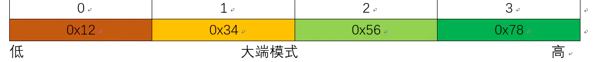

# CPP-Basic

## 0. 编译
- 源文件  
    .cpp等，略  
- 目标文件  
    win: ```.obj```  
    linux: ```.o```，c/c++源文件经过编译得到的目标文件（Object File），是一些编译后但是还未链接的二进制机器码文件。
    命令：gcc -c xxx.c
  
- 链接  
    - 动态链接库（或动态库文件，共享库文件，Shared Object File）   
    win:    ```.dll```  
    linux:  ```.so```，命名规范是lib[your_library_name].so
    命令：gcc -shared xxx.c -o libxxx.so
    优点：每个可执行文件都更小。
    缺点：如果将一份目标文件移植到一个新的操作系统上，而新的操作系统缺少相应的共享库，程序将无法运行，必须在操作系统上安装好相应的库才行。
    - 静态链接库  
    win:    ```.lib```  
    linux:  ```.a```，命名规范是lib[your_library_name].a
    命令：ar -r libadd.a add.o
    优点：编译后的执行程序不需要外部的函数库支持。
    缺点：利用静态函数库编译成的文件比较大。因为整个函数库的所有数据都会被整合进目标代码中。如果静态函数库改变了,那么你的程序必须重新编译。
  
- 可执行文件  
    win:    exe  
    linux:  随便了，如```.out```  


## 1、数据结构

**基本数据类型的长度**
```c
cout << "Size of char : " << sizeof(char) << endl;
cout << "Size of int : " << sizeof(int) << endl;
cout << "Size of short int : " << sizeof(short int) << endl;
cout << "Size of long int : " << sizeof(long int) << endl;
cout << "Size of float : " << sizeof(float) << endl;
cout << "Size of double : " << sizeof(double) << endl;
cout << "Size of wchar_t : " << sizeof(wchar_t) << endl;
cout << "Size of long long  : " << sizeof(long long ) << endl;

// Size of char : 1
// Size of int : 4
// Size of short int : 2
// Size of long int : 4
// Size of float : 4
// Size of double : 8
// Size of wchar_t : 2
// Size of long long  : 8

```

**顺序容器**
- vector    动态数组
- string    字符串
- deque   双向队列
- list      双向列表
    允在 list 的任意位置插入元素，而不会造成很大的开销。但随机访问，list 比 vector 慢。
```c++
#include <vector>
#include <string>
#include <deque>
#include <list>

vector<string> vector1;
deque<string> deque1;
list<string> list1;
```


## 2、枚举类型定义的默认值
```c
// 默认情况下，第一个名称的值为 0，第二个名称的值为 1，第三个名称的值为 2，以此类推。
// 所以 RED默认为0，GREEN默认为1 ......
enum COLOR {
    RED, GREEN, BLUE
};

// 您也可以给名称赋予一个特殊的值，只需要添加一个初始值即可。
// 此时，RED为0，GREEN为5，BLUE为6
// 在这里，blue 的值为 6，因为默认情况下，每个名称都会比它前面一个名称大 1。
enum COLOR {
    RED, GREEN = 5, BLUE
};

```
## 3. string和stringstream
**string**
| 方法 | 描述 |
| -- | -- |
| c_str | 返回等效的字符数组，用于c++和c字符串的转换 |
| data  | 得到等效的字符串数据  |
| copy  | 复制字符序列  |
| find  | 查找字符  |
| find_first_of  | 查找字符第一次出现的位置  |
| find_last_of  | 查找字符最后次出现的位置  |
| substr | 子串 |
| replace | 替换字符串 |
| length | 返回字符串的长度 |
| compare | 比较 |

**stringstream**
```c++
stringstream ssSql;
ssSql << "balabala" << version << "abababa";
```
使用 ```str("")``` 方法清除stringstream的内容，clear() 方法不起作用


## 4. 对象实例化

- 方式一：
```c++
// 在栈上实例化一个对象数组。使用完后内存是自动销毁的
Student s1;

// 开始使用
s1->name = "123";
```

- 方式二：
```c++
// 在堆上实例化一个对象数组。
Student *s2 = new Student();
//这里需要判断申请的内存是否成功
if(NULL == s2)
{
    cout<<"申请内存失败"<<endl;
    return 0;
}
// 使用完后，必须要通过delete来销毁这个对象
delete s2;
```
## 5. 占位符
### 5.1 printf输出占位符
>https://blog.csdn.net/qq_29350001/article/details/52278308

**说明符**

| 符号  | 说明 |
| -- | -- |
| %d | 有符号十进制整数 |
| %f | 浮点数十进制整数 |
| %s | 字符数组 char* |

**修饰符**

| 符号  | 说明 |
| -- | -- |
| digit 或* | 字段宽度的最小值。如果该字段不能容纳要打印的数或者字符串，系统就会使用更宽的字段。当为  * 号时，表示从参数中获取宽度。例：“%4d”、printf("%*d", width, num) |
| .digit或 .*    |精度。对于%e、%E和%f转换，是将要在小数点的右边打印的数字的位数。对于%g和%G转换，是有效数字的最大位数。对于%s转换，是将要打印的字符的最大数目。对于整数转换，是将要打印的数字的最小位数,如果必要，要使用前导0来达到这个位数。只使用“."和使用“.0”相同，所以%f与%.0f相同。当为 * 号时，表示从参数中获取精度。例：“%5.2f“、printf("%5.*f", precision, num)|
|  | |

### 5.2 scanf输入占位符


### 6 大小端
以一个数```0x12345678```存放在一个```4字节```空间里为例。   
**大端（存储）模式**：是指一个数据的低位字节序的内容放在高地址处，高位字节序存的内容放在低地址处。


**小端（存储）模式**：是指一个数据的低位字节序内容存放在低地址处，高位字节序的内容存放在高地址处。（可以总结为“小小小”即低位、低地址、小端）。


注意：   
**为了避免网络两端不同平台的差异，在TCP/IP协议规定了在网络上必须采用网络字节顺序，也就是大端模式。**


--------------

## n. 问题：
1. 头文件和源文件的关系，以及两者存放的位置。没有头文件会怎么样？

2. 


3. ```#include``` 中的 ```""```和```<>```的区别
```#include <>``` 引用的是编译器的类库路径里面的头文件。
```#include ""``` 引用的是你程序目录的相对路径中的头文件，如果在程序目录没有找到引用的头文件则到编译器的类库路径的目录下找该头文件。

4. 纯虚函数
```java
virtual ~Base() = default;
virtual ~Base() = 0;
```
    

4. 数组作为方法的入参，大小必须指定么？

5. 成员变量、全局变量、静态变量、方法内静态变量

6. g++ 和 gcc 的区别


## 
