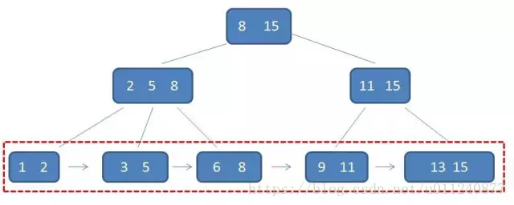

## 索引
**索引（Index）**是帮助MySQL高效获取数据的**数据结构**。索引中的元素就是一个指针，指向表里的数据。
- 索引通常与相应的表时分开保存的，目的是提高检索的性能。
- 索引的创建与删除不会影响数据本身，但会影响数据检索的速度。
- 索引也会占据物理存储空间，可能比表本身还大，因此创建索引**也要考虑存储空间**。
- 表中如果建有大量索引将会影响`INSERT`、`UPDATET`、`DELETE`语句的性能。因为在表中的数据更改时，所有的索引都将必须进行适当的调整。需要避免对经常更新的表进行过多的索引，并且索引应保持较窄，列要尽可能的少。
- 对于内容基本重复的列（比如只有1和0），禁止建立索引。因为该索引选择性极差，在特定的情况下会误导优化器做出错误的选择，导致查询速度极大下降。当一个索引有多个列构成时，应注意将选择性强的列放在前面。仅仅前后次序的不同，性能上就可能出现数量级的差异。
- 表示索引的数据结构（如B+树等），**树的高度越低**（“矮胖”），那么从磁盘中查找数据（先读取到内存、再查找）的过程中，**磁盘IO次数就越少**。

### 1、 索引的分类

参考：
> [《主键与唯一索引的区别》](https://blog.mimvp.com/article/7462.html)
> [《MySQL索引原理，一篇从头到尾讲清楚》](https://juejin.cn/post/6931901822231642125#heading-4)

- **常规索引（KEY 或 Index）**
  - 默认的。使用`key`或`index`关键字可以设置某一列为“常规索引”

- **唯一索引（Unique key）**
  - 如果欲为某一列创建唯一索引，那么要求该列的数据不可重复
  - 该列中的值可以为`NULL`
  - 一张表中可以有多个列标识为“唯一索引”

- **主键索引（Primary key）**
  - 主键是一条数据的唯一的标识；
  - 主健可以是一个字段（一列），也可是多个字段（多列）的组合。
  - 被定义为主键的列中，该列的数据不可重复，并且不能包含`NULL`
  - 一张表中要么没有主键，验最多只有一列作为主键。所以一张表中最多只能有一列作为“主键索引”
  - 主键索引是唯一索引的特殊类型

- **全文索引（Full Text）**
  - MyISAM 数据库引擎才支持，用于快速定位数据。
  - 是搜索引擎的关键技术，也被叫做倒排文档技术。

- 联合索引
  - 多个字段

### 2、使用
```sql
-- 查询一张表的所有索引
SHOW INDEX FROM xxxx

-- 增加索引（以唯一索引为例）
-- 方式一：
ALTER TABLE `表名` ADD UNIQUE KEY `索引名`(`列名`)
--  方式二：·
CREATE UNIQUE INDEX `索引名` ON `表名`(`列名`)

-- 创建表时指定索引，并指定索引名
CREATE TABLE `Students` (
  `id` INT(4) NOT NULL AUTO_INCREMENT COMMENT 'id hao',
  `name` VARCHAR(50) NOT NULL DEFAULT '匿名' COMMENT 'xing ming',
  `pwd` VARCHAR(50) NOT NULL DEFAULT '123456' COMMENT 'mi ma',
  `age` INT(4) NOT NULL DEFAULT '0' COMMENT '年龄',
  PRIMARY KEY (`id`),
  UNIQUE KEY `Name_index`(`name`)
) ENGINE=INNODB DEFAULT CHARSET=utf8

```

### 3、索引的原理
参考：  
[《3 分钟理解完全二叉树、平衡二叉树、二叉查找树》](https://mp.weixin.qq.com/s/K_oGI2rl3epTirxkST5LVQ)
[《漫画：什么是B-树？》](https://mp.weixin.qq.com/s?__biz=MzIxMjE5MTE1Nw==&mid=2653190965&idx=1&sn=53f78fa037386f85531832cd5322d2a0
)  
[《漫画：什么是B+树？》](https://mp.weixin.qq.com/s/jRZMMONW3QP43dsDKIV9VQ)  
[《重温数据结构：理解 B 树、B+ 树特点及使用场景》](https://blog.csdn.net/u011240877/article/details/80490663)
[《MySQL 为什么采用 B+树作为索引？5年经验程序员回答让我悟了》](https://juejin.cn/post/7081065180301361183)


#### 3.1 预备知识

**`完全二叉树`** 与 **`满二叉树`**：
概念定义略


**`Binary Search Tree（二分查找树、二分搜索树或BST）`**，及其查找效率：平均时间的时间复杂度为 `O(log n)`，最差情况为 `O(n)`。  
当出现左右子树不平衡时，查找效率会退化成O(n)。

**`平衡二叉树`** 是对BST的一种改进。AVL的核心思想就是：**BST + 左右子树高度差不超过1**
AVL树和红黑树

#### 3.2 B-树
- **`B-树`**，就是“B树”，不是“B减树”，又称**平衡多路查找树**，表示`B-树`不止两个子树（B数是“多叉树”）。
- `M阶` B树表示该树每个节点最多有`M`个子树。
- 非叶子节点中，最多有`M-1`个元素Key


例如：以表示往`4阶B-树`中依次插入下面这组数据的过程。  
候选数据：`6 10 4 14 5 11 15 3 2 12 1 7 8 8 6 3 6 21 5 15 15 6 32 23 45 65 7 8 6 5 4`


#### 3.3 B+树
- `M阶` B+树表示该树每个节点最多有`M`个子树。
- 非叶子节点中，元素Key个数和子树个数相同
- 非叶子节点仅用作索引：非叶子节点中的元素Key表示其子树元素中最大（或最小）的元素。
- 叶子节点用指针连在一起，构成有序的双向链表

  

MySQL中使用B+树作为索引的数据结构，举例来说：  
  


#### 3.4 
- 为什么B-树有多个子节点，而不是“二叉”（两个子节点）
  答：B-树有多个节点，可以降低树的高度。树的高度会增加磁盘I/O次数，影响查询效率。
- 和B+树比较，B-树的局限性
  1. 做范围查找时，效率低
- MySQL索引要考虑的因素
  1. 要尽少在磁盘做 I/O 操作
  2. 要能尽快的按照区间高效地范围查找

## FAQ

### 索引页+数据页组成的组成的B+树就是聚簇索引

### 非主键索引？？？

### 回表？？？

