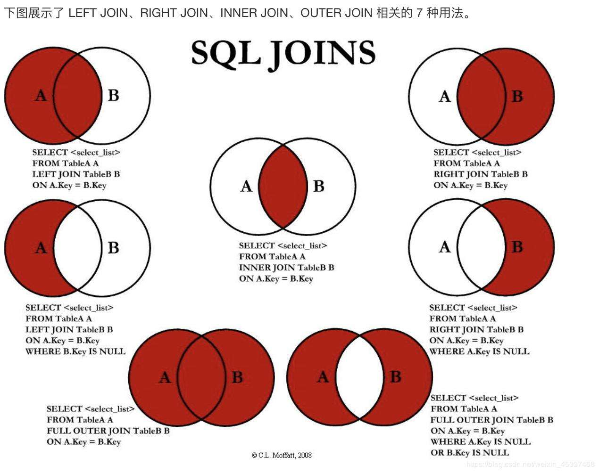

## SQL 举例

### 1、DDL
数据定义语言DDL

#### 1.1 数据库相关

```sql
-- 创建数据库
CREATE DATABASE IF NOT EXISTS `school` CHARACTER SET utf8 COLLATE utf8_general_ci;

-- 已知一个数据库，查询创建这个数据库的SQL语句
show create database `DBName`
```

#### 1.2 表相关

```sql
-- 创建一张数据表
CREATE TABLE `Students` (
  `id` int(4) NOT NULL AUTO_INCREMENT COMMENT 'id hao',
  `name` varchar(50) NOT NULL DEFAULT '匿名' COMMENT 'xing ming',
  `pwd` varchar(50) NOT NULL DEFAULT '123456' COMMENT 'mi ma',
  `age` int(4) NOT NULL DEFAULT '0' COMMENT '年龄',
  PRIMARY KEY (`id`)
) ENGINE=InnoDB DEFAULT CHARSET=utf8

-- 已知一张表，查询创建该表的SQL语句
show create table `tableName`

-- 修改表的名称
ALTER TABLE `Students` RENAME AS `student`

-- 增加表的字段
ALTER TABLE `Students` ADD `addition` VARCHAR(50) NOT NULL DEFAULT 'my addition'

-- 修改表的字段
-- 将 addition 列，由 VARCHAR 修改为 INT
ALTER TABLE `Students` MODIFY `addition` INT(10)
-- 将 addition 列重命名
ALTER TABLE `Students` CHANGE `addition` `addition1` VARCHAR(50)

-- 删除表的字段
ALTER TABLE `Students` DROP `addition`

-- 删除一张表
DROP TABLE IF EXISTS `Students` 
```

#### 1.3 在修改表的过程中， MODIFY 和 CHANGE 的区别是啥
- MODIFY
可以修改表的字段的约束和类型，不能重命名

- CHANGE
重命名一个表的字段
不能修改约束和类型？？？？存疑，经过验证是可以的

#### 1.4、外键Foreign Key
##### 创建外键
- 在创建数据表的时候指定外键

- 对于已经创建的表，可以再添加外键约束
```sql
-- ALTER TABLE `表名` ADD CONSTRAINT `约束名` FOREIGN KEY(`作为外键的字段`) REFERENCES `被引用的表`(`作为外键的字段`)
ALTER TABLE `Students` 
ADD CONSTRAINT `FK_gradeid` FOREIGN KEY(`gradeid`) REFERENCES `Grade`(`gradeid`)
```

##### 删除外键
`Table A` 中的一列 **引用reference** `Table B`中的字段  
删除时，应该先删除 `Table A`，才能删除`Table B`；而不能直接删除`Table B`。


### 3、DML 语言
增、删、改

#### 3.1 插入
`insert`
```sql
-- 插入一行或者多行，每个字段都赋值
-- 此时，value中的值需要与表中的字段一一匹配
INSERT INTO `students` VALUES 
(2,'gsx1','123456',8,'ggggg'),
(4,'gsx2','123456',8,'ggggg')

-- 插入一行或者多行，每个字段都赋值
-- 自增的列若未指定，则自增
INSERT INTO `students`(`name`,`pwd`,`age`) VALUES 
('gsx1','123456',8),
('gsx2','123456',8)

```


#### 3.2 更新
`update`
```sql
-- 更新指定条件的数据
UPDATE `students` SET `name`="zhangsan",`age` = 10 WHERE id = 1

-- 更新表中所有数据
UPDATE `students` SET `name`="zhangsan",`age` = 10

-- 读取一个变量然后赋值
UPDATE `students` SET `birthday`=current_time ,`age` = 10

```

#### 3.3 删除
- `delete`
```sql
-- 清空整张表
delete from `xxx`

-- 删除指定数据
delete from `xxx` where id=123
```
- `truncate`  
清除一张表的数据，保留表的结构和索引不变
```sql
-- 清空整张表
truncate table `xxx`
```

**问题一：delete 和 truncate 的区别?**  
**相同点：**  
都可以用于删除表的数据，不会影响表的结构

**不同点：**  
- 使用`truncate`清空表后，自增列计数器重置；使用`delete`清空表后，自增计数器不重置  
- 不影响事务

**问题二：使用delete删除数据后，重启数据库的现象？（存疑）**
- InnoDB，自增从1开始（存在内存中，断电即失）
- MyISAM，继续从上一个自增量开始（存在文件中，不会丢失）


### 4、DQL 语言
Data Query Language
```sql
-- 注意这些关键字的顺序，不能颠倒
SELECT ...
FROM ...
  WHERE ...
  GROUP BY ...
  HAVING ...
  ORDER BY ...
  LIMIT ...

```

#### 4.1 基本查询举例

```sql

-- 去重 distinct
SELECT DISTINCT pwd FROM `students` 

-- 别名：AS 给表或字段起别名
SELECT `name` AS n,`pwd` AS p FROM students WHERE `name`="gsx"

-- 函数：CONCAT(a,b) 将a和b拼接成一个字符串输出
SELECT CONCAT('name is ',`name`) AS `n`,CONCAT(`pwd`,' is pwd') AS `p` FROM students WHERE `name`="gsx1"

-- 表达式：用来计算
SELECT 1+1 AS result 
SELECT `name`, `age` AS '修改前',`age`+1 AS '修改后' FROM `students` WHERE `pwd`="123456"

-- 变量：查询自增步长
SELECT @@auto_increment_increment

```

#### 4.2 连表查询

关于表连接理论的7中不同方式：



- 内连接(join 或 inner join)
```sql
A join B on A.a = B.b 
```

- 左外连接


- 右外连接


- 笛卡尔积


- 自连接
自己与自己连接：一张表看成两张不同表，根据key进行连接

#### 4.3 排序与分页
``` sql
-- 排序 order by
-- ASC 升序; DESC 降序
SELECT * FROM `students` 
ORDER BY `age` ASC

-- 分页 
-- 语法:limit 数据（看成数组）起始下标,偏移个数
SELECT * FROM `students` LIMIT 3,5


```


#### 4.4 子查询（嵌套查询）

sql查询优先级？？？？待验证
查询过程是“由内而外”的，即先执行子查询，再执行外部的查询

```sql
-- 查询 result 表中 数据结构 课程的所有信息

-- 方式一：联表查询
SELECT r.studentNo,s.subNo
FROM `result`  AS r 
INNER JOIN `subject` AS s
ON r.subjectNo = s.subjectNo
WHERE s.subName = '数据结构'

-- 方式二：嵌套查询
SELECT * FROM `result`
WHERE `subNo` = (
  SELECT `subNo` FROM `subject`
  WHERE `subName` = '数据结构'
)

```

#### 4.5 SQL函数

- 常用函数
```sql
-- 数学运算

-- 绝对值
SELECT ABS(-1.1)      -- 值为 1.1
-- 向上取整
SELECT CEILING(3.14)  -- 值为 4
-- 向下取整
SELECT FLOOR(3.14)
-- 取随机数 [0,1)
SELECT RAND()
-- 获取一个数的符号
SELECT SIGN(-2.1)     -- 0：0，正数：1，负数：-1


-- 字符串

-- 返回字符串的长度
SELECT CHAR_LENGTH("abcdefg")
-- 字符串拼接
SELECT CONCAT("I ","am ","a ","boy")
-- 插入并替换
SELECT INSERT("abcdefg",1,2,"xyz")  -- xyzcdefg
SELECT INSERT("abcdefg",1,0,"xyz")  -- xyzabcdefg
-- 大小写
SELECT UPPER("abcd")
SELECT LOWER("ABCD")
-- 字符串替换：将所有匹配的字符串替换成目标字符串
SELECT REPLACE("abcccdefg","c","xyz")   -- abxyzxyzxyzdefg
SELECT REPLACE(`name`,'zhang','xxx') FROM `students` 
-- 字符串截取
SELECT SUBSTR("abcdefg",2,3)    -- bcd
-- 字符串翻转
SELECT REVERSE("abcd")    -- dcba

-- 日期与时间
SELECT CURDATE()	    -- 当前日期2022-01-05
SELECT NOW()		      -- 当前时间 2022-01-05 22:30:40
SELECT LOCALTIME()	  -- 2022-01-05 22:30:40
SELECT YEAR(NOW())	  -- 2022
SELECT MONTH(NOW())	  -- 1
SELECT DAY(NOW())	    -- 5
SELECT HOUR(NOW())	  -- 22
SELECT MINUTE(NOW())	-- 30
SELECT SECOND(NOW())	-- 40

-- 系统信息
SELECT VERSION()
SELECT USER()
SELECT SYSTEM_USER()

-- MD5
UPDATE `students` SET `pwd` = MD5(`pwd`)
SELECT * FROM `students` WHERE `pwd` = MD5('123456')


```

- 聚合函数
```sql
-- count() 计数
SELECT COUNT(`id`) FROM `students`
SELECT COUNT(*) FROM `students`
SELECT COUNT(1) FROM `students`

-- sum() 求和

-- avg() 求平均值

-- min() 最小值

-- max() 最大值

```


### 5、 where条件判断

#### 5.1 运算符

| 操作符 | 含义 |
| -- | -- |
`=`             | 等于
`<>` 或 `!=`    | 不等于
`>`             | 大于
`<`             | 小于
`>=`            | 大于等于
`<=`            | 小于等于

#### 5.2 逻辑运算符：与、或、非

| 操作符 | 含义 |
| -- | -- |
`and`         | 与(多条件同时满足)
`&&`          | 同上
`or`          | 或（多条件满足一个即可）
`||`          | 同上
`not`         | 非
`! `          | 同上

```sql
-- 举例

-- 查询表中年龄不是10岁的所有信息
select * from `student` where age != 10;
-- 或
select * from `student` where not age = 10;
```

#### 5.3 模糊查询

| 操作符 | 含义 |
| -- | -- |
`IS NULL`       | 等于
`IS NOT NULL`   | 不等于
`between and`   | 闭区间
`like`          | 字符匹配，`%`:0-n个字符，`_`:匹配1个字符
`in`            | `a in(v1,v2,v3...)`，表示 `a`为其中一个值的时候即为真

```sql
-- 举例

-- like  
select * from `student` 
where name like 'Guan%'

-- in 查询年龄为10、11、12、13岁的所有信息
select * from `student`
where age in(10,11,12,13)


```


### FAQ

#### `count(列名)` `count(*)`和`count(1)` 的区别
- `count(列名)`：为null时，会忽略计数
- `count(*)`
- `count(1)` 

