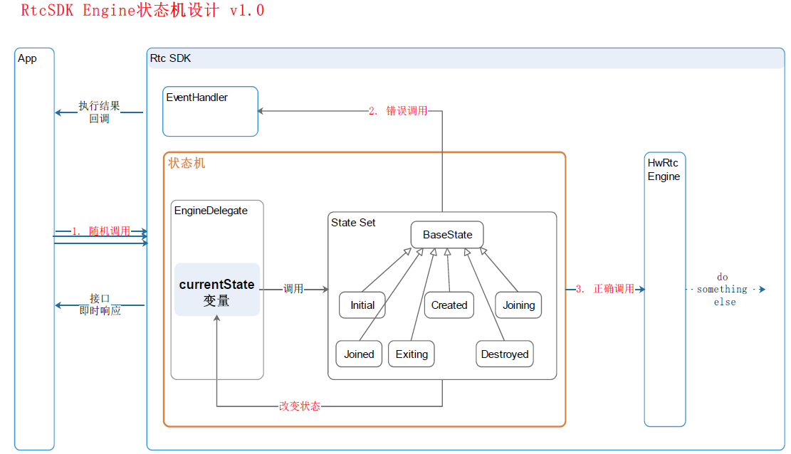

# 状态模式与状态机
> 定义：当一个对象内在状态改变时允许其改变行为，这个对象看起来像改变了其类。

个人理解：系统在整个运行周期中会处于若干有限个状态，且每一种状态都有一组可执行的动作。在某一时刻的任意状态下，程序可以从一个状态切换到另一种状态。

**1、举例说明**
- 小明一天中可以做这么几件事情：睡觉、吃饭、看电视、写代码、吹牛、划水
- 小明一天中可能处于这么几种状态：在家的状态（A）、上班的状态（B）、聚会的状态（C）
- 小明的一天是这样度过的：早晨在家，然后去上班，下班后去聚会，最后回家。
画个图就是：
```
    A ---> B 
    ^       |
    |       ˇ
    | ----- C
```

- 小明是一个跟自律的人，在某一个状态下只能做其中的某些事情，比如
在家的状态（A）：可以 睡觉、吃饭、看电视
上班的状态（B）：吃饭、写代码、划水
聚会的状态（C）：吃饭、吹牛、划水

上面的场景并不复杂，大家使用 ```if-else``` 也能实现。但是作为一名有追求的打工人，熟练掌握各种```if-else```并不能让工作更有灵魂。
所以，我们引入了状态模式与状态机

**2、状态模式**

[点我看类图](https://user-gold-cdn.xitu.io/2019/10/13/16dc3f49213a5dff?imageView2/0/w/1280/h/960/format/webp/ignore-error/1)

具体例子就参考网上的帖子吧：
[状态模式](https://juejin.cn/search?query=%E7%8A%B6%E6%80%81%E6%A8%A1%E5%BC%8F&type=all)
[设计模式:状态模式](https://juejin.cn/post/6844903967151898637)

- 状态模式的优点
符合单一职责原则:将状态封装成了独立的类，并将动作委托给了该状态类的对象
符合开放封闭原则:在不更改现有状态类或上下文的情况下引入新状态。
避免了过长的if 或者是switch判断。

- 状态模式的缺点
如果一个系统有很多种状态，那么状态子类会太多。
如果类只有几个状态或很少更改，应用状态模式可能会过度设计。

**3、RTC中的状态机**



- RtcSDK提供API接口，上层应用App对接口进行调用，SDK提供EventHandler将执行结果回调给上层App
- 上层应用App可能在任何时机调用SDK的API接口，并可以立即获得一个返回值。该值表示SDK接口已响应，并非接口的执行结果
- RtcSDK的入口由状态机控制。状态机中包含一组状态，可以根据App调用的API接口，动态调整当前状态变量（currentState）。
- 对于当前状态允许的操作，可以进入HwRtcEngine中执行；对于当前状态禁止的操作，将通过EventHandler回调给上层应用App


