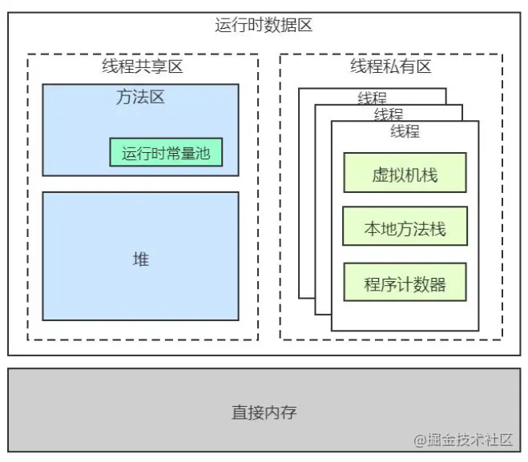
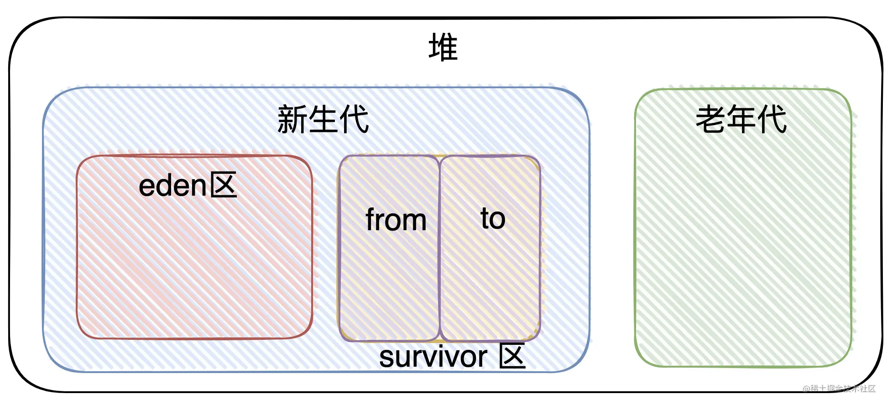

# JVM基础

参考：   
[《理解Java内存模型》](https://juejin.cn/post/6844903716844208136)  
[《面试官问我JVM内存结构，我真的是》](https://juejin.cn/post/7025763374566735886)  
[《动图图解GC算法 - 让垃圾回收动起来》](https://juejin.cn/post/7063011785850241061)

## 1、JVM与Java程序的关系
一个虚拟机是一个软件实现物理机。JVM的目的是为了屏蔽不同硬件和操作系统的差异，实现同一个Java程序可以在各个平台的运行的目的。一个JVM实例其实就是JVM跑起来的进程，每个java程序都运行在一个单独的JVM实例上。各个JVM实例之间是相互隔离的。  
事实上在执行java程序时，我们注意到命令行为“java xxx”，其实java就是实例化jvm实例的命令

## 2、JVM内存模型（运行时数据区域）
1. 程序计数器：  
**线程私有** 一块较小内存区域。如果线程正在执行一个Java方法，那么程序计数器记录**正在执行的虚拟机字节码指令的地址**，用于线程切换后的恢复；如果执行的是Native方法，那么这个程序计数器的值为空。
2. Java虚拟机栈（JVM栈）：  
**线程私有** java方法执行的内存模型。每个线程在创建的时候都会创建一个虚拟机栈，其生命周期和线程一致。每个方法的执行都会创建一个**栈帧**（存储了**局部变量表**、操作数栈和方法出口等）；栈帧的入栈和出栈，表示方法的调用和完成；
3. 本地方法栈（Native Method Stack）：  
**线程私有** 类比虚拟机栈，本地方法栈用于管理Native方法的调用
4. Java堆：  
**共享** 存放所有对象的**实例和数组**。“堆”被划分为“新生代”和“老年代”，“新生代”又被进一步划分为 Eden 和 Survivor 区，最后 Survivor 由 From Survivor 和 To Survivor 组成。如果在堆中没有内存完成实例分配，并且也无法再扩展时，将会抛出```OutofMemoryError```异常。
5. 方法区：  
**共享** 是各个线程 共享的内存区域，它用于存储已经**被虚拟机加载的类信息、常量、静态变量**、即时编译器编译后的代码等数据（JDK 1.7：永久代，JDK 1.8：元空间）。**运行时常量池** 属于方法区的一部分，存储的是“类加载”时生成的“直接引用”等信息



Java堆的划分：


```bash
# 补充图
```

## 3、Java内存模型（Java Memory Model，简称JMM）

JVM内存模型三大特性包括 **原子性（Atomicity），可见性（Visibility），有序性（Ordering）**。

### 3.1 Java内存模型分为**主内存（Main Memory）**和**工作内存（Working Memory）**：
- 主内存是所有的线程所共享的，工作内存是每个线程私有的，不是共享的。
- 线程的工作内存中保存了被该线程使用到的变量的主内存**副本**。
- 线程对变量的所有操作（读取、赋值），都必须**在工作内存中进行**，而不能直接读写主内存中的变量。
- 主内存并非硬件系统的主存（Main Memory），而是JVM内存的一部分。只是名字相同罢了

```
Java线程 -- 工作内存 --	 
					 |		
Java线程 -- 工作内存 --	读写操作 -- 主内存
					 |		
Java线程 -- 工作内存 --	
```
### 3.2 Java内存操作的并发问题
上面介绍的Java内存模型，我们可以看到两个并发问题：
1. 工作内存数据一致性  
当多个线程的运算任务都涉及同一个共享变量时，将导致各自工作内存的共享变量副本不一致。
2. 指令重排序  
通常是**编译器或运行时环境（处理器）**为了优化程序性能而采取的对指令进行重新排序执行的一种手段。重排序分为两类：**编译期重排序和运行期重排序**，分别对应编译时和运行时环境。指令重排序可以保证，在单线程下执行结果与顺序执行（未重排序）时是一致的。因此在多线程下可能会出现一些意想不到的问题。

## 3.3 Java内存模型和JVM内存模型有什么关系
没啥关系...
- Java内存模型是跟「并发」相关的，它是为了屏蔽底层细节而提出的规范，希望在上层(Java层面上)在操作内存时在不同的平台上也有相同的效果
- JVM内存结构又称为运行时数据区域，它描述着当我们的class文件加载至虚拟机后，各个分区的「逻辑结构」是什么样的，每个分区承担着什么作用。

## 元空间
JDK 1.8：元空间，Metaspace  
JDK 1.7及以下：永久代，PermGen space  
元空间的本质和永久代类似，**都是对JVM规范中方法区的实现**。最大的区别在于：元空间并不在虚拟机中，而是使用本地内存。  

## 编译
0. 
	**解释器**：在执行程序时,才逐条地解释成机器语言给计算机来执行。速度慢、节约内存。  
	**编译器**：每一条语句都编译成与平台相关的机器语言再执行。速度快

1. 
	Java源码的编译是由javac编译器来完成的。Java字节码的执行是由JVM执行引擎来完成  
```源码 -> 词法分析 -> 语法分析 -> 语义分析 -> 字节码生成(class文件)```

2.  
	HotSpot虚拟机：  
	解释和编译配合工作  
	即时编译器JIT（Just In Time Compiler）  


## GC相关

### 术语：
“堆”被划分为“新生代”和“老年代”，“新生代”又被进一步划分为 Eden 和 Survivor 区，最后 Survivor 由 From Survivor 和 To Survivor 组成

- 堆
  - 新生代
    - Eden
    - Survivor
      - From Survivor
      - To Survivor
  - 老年代 

Minor GC：对新生代（包括 Eden 和 两个Survivor 区域：from、to）执行GC  
Major GC：对老年代执行GC  
Full GC：收集整个堆执行GC  

### 判断是否需要回收
1. 引用计数法  
	- 原理：给对象添加一个引用计数器。如果一个地方引用这个对象，计数器就加一；如果引用失效，计数器就减一。如果一个对象的引用计数器是0，那么这个对象就是不可用的。  
2. 可达性分析法  
	- 原理：从GC ROOT开始向下搜索，形成引用链。如果一个对象没有与任何一个GC ROOT相连，那么这个对象就是不可用的。
	- **GC Roots都有哪些**：
		1. 虚拟机栈中（栈帧中的局部变量）引用的对象 
		2. 方法区中静态属性引用的对象，常量引用的对象 
		3. 本地方法栈中JNI（即Native方法）引用的对象。

### 回收算法
- 标记清除算法
- 标记整理
- 复制算法
- **分代收集**：新生代使用复制算法（存活的对象少，只需要少量的复制成本就可以完成收集），老年代使用标记清除算法或者标记整理算法（存活率高）

## 什么情况会出现Full GC，什么情况会出现yong GC
1. 新生代有一个```Eden区```和```两个survivor区```，首先将对象放入Eden区，如果空间不足就向其中的一个survivor区上放，如果仍然放不下就会引发一次发生在新生代的 minor GC，将存活的对象放入另一个survivor区中，然后清空Eden和之前的那个survivor区的内存。在某次GC过程中，如果发现仍然有放不下的对象，就将这些对象放入老年代内存里去。

2. 大对象以及长期存活的对象直接进入老年区。

3. 当每次执行minor GC的时候应该对要晋升到老年代的对象进行分析，如果这些马上要到老年区的老年对象的大小超过了老年区的剩余大小，那么执行一次Full GC以尽可能地获得老年区的空间。

### stop-the-world
不管选择哪种GC算法，```stop-the-world```都是不可避免的。Stop-the-world意味着从应用中停下来并进入到GC执行过程中去。一旦Stop-the-world发生，除了GC所需的线程外，其他线程都将停止工作，直到GC任务结束

## 什么情况下会引起内存泄漏
内存泄漏是指使用资源之后没有及时释放，导致垃圾回收器无法回收原本应该被回收的对象。

## jvm调优如何检查内存泄露，如何优化gc参数


## java跨平台、执行效率分析（Bigo面试奇葩）


## JAVA_TOOL_OPTIONS 环境变量
- JAVA_OPTS
	常用于一些应用的配置，如Tomcat，但它一般不作为环境变量，也不能被JVM识别的，是那些应用的自定义配置；

- _JAVA_OPTIONS
	也是作为环境变量来替代命令行参数的，但它是JVM厂家自定义的，可以覆盖JAVA_TOOL_OPTIONS，但各厂家的不同，_JAVA_OPTIONS是Oracle的JVM，而IBM的则是用IBM_JAVA_OPTIONS。

- JAVA_TOOL_OPTIONS
	是标准的，所有虚拟机都能识别和应用的。

## Java命令
1. javac

2. javap
```bash
# 查看class文件的字节码
javap -s HelloNetworkManager
```
3. java -jar


