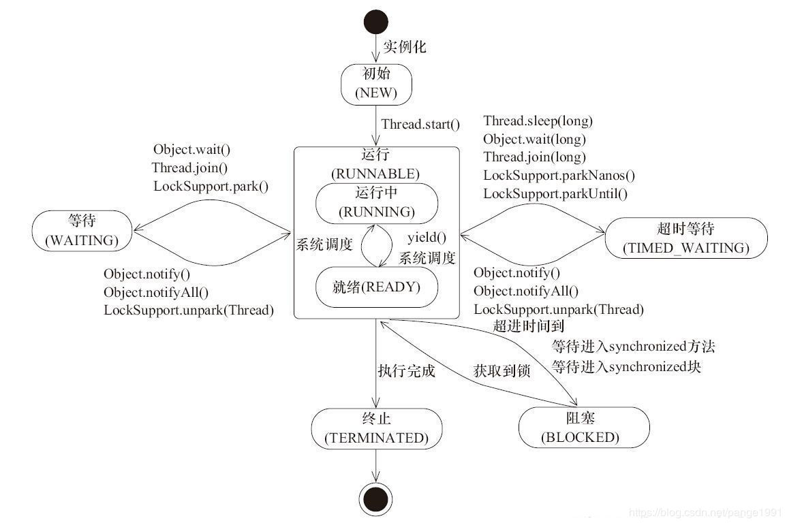

# Java-Thread
参考：
[《高并发编程从入门到精通》系列](https://juejin.cn/post/6844904195091349512)
[《进程、线程基础知识全家桶，30 张图一套带走》](https://xie.infoq.cn/article/8e66fa7ebe4d310db95b39c31)
[《啃碎并发（三）：Java 线程上下文切换》](https://xie.infoq.cn/article/fccf4cc4523aba603525bbb37)


## 1、基本问题汇总

### 1.1 进程和线程的区别
- 进程是资源分配的最小单位，线程调度的最小单位  
- 进程有独立的地址空间，因此创建和销毁的代价比较大  
- 线程是共享进程中的数据的，使用相同的地址空间，因此代价比较小
	- 优点：开销小（*体现在创建、销毁和切换三个方面：同一个进程中的线程之间切换时，因为共享进程的内存，所以除了私有变量，其他资源是不需要切换的*）
	- 缺点：当进程中的一个线程奔溃时，会导致其所属进程的所有线程奔溃  

**扩展：**
1. 创建子进程：
- ```fork```函数：通过拷贝当前进程创建一个子进程，子进程和父进程的区别就只在于PID(进程id)和PPID(父进程id)和少量资源
- ```exec```函数：负责读取可执行文件并载入地址空间开始运行。通常是指exec函数族。
2. ```内核线程```和```用户线程```
- 内核线程是独立运行于内核空间的标准进程，他们没有独立地址空间，从来不会切换到用户空间去。
- 用户线程就是咱们所认知的普通线程了。
3. [Linux用户态与内核态](https://www.cnblogs.com/bakari/p/5520860.html)

### 1.2 Java创建多线程的方法
1. 继承Thread，重写run()方法
2. 实现Runnable接口(Thread类就是实现了Runnable接口)，实现run()方法
3. 实现Callable接口，重写call()方法，然后实例化FutureTask类

**注意：Callable与Runnable的区别**
1. Callable定义的方法是call，而Runnable定义的方法是run。
2. Callable的call方法可以有返回值，而Runnable的run方法不能有返回值。
3. Callable的call方法可抛出异常，而Runnable的run方法不能抛出异常。
4. Callable和Runnable都可以通过ExecutorService的submit提交执行，单只有runnable能应用于Thread类

### 1.3 Thread设置名称
```new Thread(runnable,threadName);```
```thread.setName(xxxxx);```

### 1.4 启动线程
需要调用Thread的```start()```方法，而不是```run()```方法。
```run()```方法里面只是开发者希望在线程中完成的逻辑。
真正创建线程和调用```run()```方法，需要调用```start()```方法，由jvm来完成的。

### 1.5 线程池的好处
- 降低资源消耗，提高响应速度。通过重复利用已创建的线程，降低线程创建和销毁造成的消耗。
- 提高线程的可管理性，避免无限制创建线程耗尽系统资源。使用线程池可以进行统一的分配，调优和监控。


### 1.6 进程的数据结构
使用 **进程控制块（process control block，PCB）** 来描述进程的，**PCB 是进程存在的唯一标识**。一个PCB的创建和回收，表示了一个进程的创建和销毁。
PCB中通常包含以下信息：
- 进程描述信息：
	- 进程标识符：标识各个进程，每个进程都有一个并且唯一的标识符；
	- 用户标识符：进程归属的用户，用户标识符主要为共享和保护服务；

- 进程控制和管理信息：
	- 进程当前状态，如 new、ready、running、waiting 或 blocked 等；
	- 进程优先级：进程抢占 CPU 时的优先级；

- 资源分配清单：
	- 有关内存地址空间或虚拟地址空间的信息，所打开文件的列表和所使用的 I/O 设备信息。

- CPU相关信息：
	- CPU 中各个寄存器的值，当进程被切换时，CPU 的状态信息都会被保存在相应的 PCB 中，以便进程重新执行时，能从断点处继续执行。
操作系统可以将PCB通过链表或者索引的形式组合起来进行管理，比如**就绪队列**、**阻塞队列**等

### 1.7 线程的数据结构
使用**线程控制块（Thread Control Block, TCB）** 来描述线程.
- ```Thread.currentThread().getId()```：获取JVM级别的tid
- ```Process.myTid()```：获取系统级别的线程id。对于单线程的程序，tid等于pid，对于多线程的程序，线程的tid各不相同，但拥有相同的pid

### 1.8 子线程发生crash
如果子线程中发生未捕获的异常，子线程运行会终止。其他线程并不能感知到
#### 1.8.1 一个线程池中的线程异常了，那么线程池会怎么处理这个线程?

### 1.9 用户线程和守护线程
通过```myThread.setDaemon(false)```设置为用户线程；通过```myThread.setDaemon(true)```设置为守护线程。
**如果不设置此属性，默认为用户线程**

用户线程和守护线程的区别：
1. 主线程结束后用户线程还会继续运行,JVM存活；
2. 如果没有用户线程运行，那么所有守护线结自动束程，JVM也结束。即当JVM中所有的线程都是守护线程的时候，JVM就可以退出了；如果还有一个或以上的非守护线程则JVM不会退出。

举例：垃圾回收线程就是一个经典的守护线程。当我们的程序中不再有任何运行的Thread,程序就不会再产生垃圾，垃圾回收器也就无事可做。所以当垃圾回收线程是JVM上仅剩的线程时，垃圾回收线程会自动离开。它始终在低级别的状态中运行，用于实时监控和管理系统中的可回收资源。

### 1.10 为什么需要多线程
多个线程可以共享同一个进程中的数据和资源，能更好的利用多核CPU的性能，而且线程切换代价比较小。


### 1.11 CPU、Cores和Processor
- CPU：独立的中央处理单元，体现在主板上是有多个CPU的槽位。  
- CPU cores：在每一个CPU上，都可能有多个核（core），每一个核中都有独立的一套ALU、FPU、Cache等组件，所以这个概念也被称作**物理核**。  
- processor：这个主要得益于超线程技术，可以让一个物理核模拟出多个**逻辑核**，即processor。

简单来说就是，当有多个计算任务时，可以让其中一个计算任务使用ALU的时候，另一个则去使用FPU。
这样就可以充分利用物理核中的各个部件，使得同一个物理核中，也可以并行处理多个计算任务。


-------

## 2、线程的状态


1. **初始状态**(```New```)
new出来的Thread实例，此时线程就进入了初始状态。

2. 运行状态(```Runnable```)
	- **2.1 就绪状态**
	就绪状态只是说有资格运行。如果调度程序没有挑选到该线程，那么该线程就永远是就绪状态。
	1. 调用线程的```start()```方法，此线程进入就绪状态。
	2. 当前线程```sleep()```方法结束，其他线程join()结束，等待用户输入完毕，某个线程拿到对象锁，这些线程也将进入就绪状态。
	3. 当前线程时间片用完了，调用当前线程的yield()方法，当前线程进入就绪状态。
	4. 锁池里的线程拿到对象锁后，进入就绪状态。
	- **2.2 运行中状态**
	线程调度程序从可运行池中选择一个线程作为当前线程时线程所处的状态。这也是线程进入运行状态的唯一一种方式。

3. **阻塞状态**(```Blocked```)
阻塞状态是线程阻塞在进入```synchronized```关键字修饰的**方法或代码块(获取锁)** 时的状态。

4. **等待**(```Waiting```)
处于这种状态的线程不会被分配CPU执行时间，它们要等待**被显式地唤醒**，否则会处于无限期等待的状态。
如调用下列这些**不带参数**的方法：```Object.wait()```、```Thread.join()```、 ```LockSupport.park()```

5. **超时等待**(```Timed Waiting```)
处于这种状态的线程不会被分配CPU执行时间，不过无须无限期等待被其他线程显示地唤醒，在达到一定时间后它们会自动唤醒。
如调用下列这些**带参数**的方法:**```Thread.sleep(long)```**、```0bject.wait(long)```、 ```Thread.join(long)```、 ```LockSupport.parkNanos(long)```、 ```LockSupport.parkUntil(long)```

6. **终止状态**(```Terminated```)
当线程正常完成执行或者出现异常时。
线程一旦终止了，就不能复生。即在一个终止的线程上调用start()方法，会抛出```java.lang.IllegalThreadStateException```异常。

-----

## 3、如何优雅的结束一个线程
### 3.1 实现
**一般```run()```方法执行完，线程就会正常结束。**
但有时需要提前结束：
1. 调用```myThread.stop()```方法，容易造成不安全。不推荐使用
2. 自定义标志位flag。该标志为需要使用```volatile``` 关键字修饰，例如```public volatile boolean myFlag = false```
3. 调用```myThread.interrupt()```方法：
	- 当线程阻塞时，调用```myThread.interrupt()```方法会产生异常。捕获InterruptException异常，然后跳出循环，结束线程。
	- 当线程运行时，通过```Thread.interrupted()```、```Thread.currentThread().isInterrupted()```或```myThread.isInterrupted()```方法判断是否被终止（和“使用标志位”一个道理）。

注：在结束线程前，记得调用一次notifyAll()方法，唤醒其他所有等待的对象。（这样做更优雅）
### 3.2 扩展：
1. 对于正在运行的进程（比如正在执行while等非阻塞的时候），调用```myThread.interrupt()```方法不会中断该进程，即**该进程会继续执行**。
    因为该方法仅仅是设置一个标志位而已。**使用者需要在线程中判断该标志位，然后自行结束任务**。
2. 如果当线程走到了sleep, wait, join等阻塞这些方法的时候，调用```myThread.interrupt()```方法会抛出InterruptedException异常。
    开发者需要捕获这个异常，然后自行结束任务。注意：当JVM抛出这个异常的时候，中断标志位也会被消除。
3. 使用```Thread.interrupted()```**获取中断标志位后，会恢复该标志位为false**。即，如果第一次获取为true，第二次获取结果为false。
4. 使用```Thread.currentThread().isInterrupted()```获取中断标志位后，不会恢复该标志位。即，如果第一次获取为true，第二次结果依然为false。
5. **推荐使用```Thread.interrupted()```而**不是```Thread.currentThread().isInterrupted()```，检查自己是否被interrupt。对于```Thread.interrupted()```，Java设计者的意图可能是：**建议每个中断状态仅被消费一次。即第一次获取中断标志位后，就表明开发者已经处理该异常。所以，接着恢复该线程的标志位**

-----------

## 4、Thread常用API

- **Thread.yield():**
yield让出CPU执行权给同等级的线程，如果没有相同级别的线程在等待CPU的执行权，则该线程继续执行。  
提示调度程序，当前线程愿意放弃CPU执行权。调度程序可以无条件忽略这个提示。
这个接口不常用，不要与sleep混淆了

- **myThread.join():**
是可以让程序能按照一定的次序来完成我们想完成的工作，他的工作原理就是阻塞当前调用join的线程，让新join进来的线程优先执行。
如果在一个线程A中调用另一个线程B的join方法，线程A将会等待线程B执行完毕后再执行。

- **sleep():**
	- ```sleep()```是Thread类的方法;
	- ```Thread.sleep()```不会让线程释放锁;
	- sleep时间满后，线程进入就绪状态，需要触发操作系统重新进行一次CPU竞争
注： ```Thread.sleep(0)```的作用是“触发操作系统立刻重新进行一次CPU竞争

- **wait():**
	- ```wait()```是Object类中定义的方法
	- ```myObject.wait()```会释放锁；
	- 调用wait后，需要别的线程执行```myObject.notify()/notifyAll()```才能够重新获得CPU执行时间

- **```Thread.sleep()```和```Object.wait()```的区别：**
相同点：```Thread.sleep()```和```Object.wait()```都会暂停当前的线程，让出CPU资源；
不同点：见上面详解


-----------

## 5、线程  同步/通信  的方法：

### 5.1 同步和互斥的基本概念：
- 互斥：一个公共资源同一时刻只能被一个进程或线程使用，多个进程或线程不能同时使用公共资源。
- 同步：两个或两个以上的进程或线程在运行过程中协同步调，按预定的先后次序运行。比如 A 任务的运行依赖于 B 任务产生的数据。

### 5.2 方法
- 方法一：
**```synchronized```关键字，同步方法等**

- 方法二：
**使用 ```wait()```,```notify()```,```notifyAll()```**

- 方法三：
**Android中的Handler方式、广播、EventBus等方式**

### 5.3 ```object.wait()```与```object.notify()```的使用
当一个线程调用```wait()```方法时，JVM将这个线程置入休眠，并且释放控制这个同步代码块的对象，同时允许其他线程执行这个对象控制的其他同步代码块。为了唤醒这个线程，必须在这个对象控制的某个同步代码块中调用```notify()```或者```notifyAll()```方法。

```wait()```,```notify()```,```notifyAll()```方法则必须放在 ```synchronized```块里面

如果对象调用了```wait()```方法就会释放当前线程对 lock 对象持有的锁，然后处于等待状态。

如果对象调用了```notify()```方法就会通知某个正在等待这个对象的控制权的线程可以继续运行。

如果对象调用了```notifyAll()```方法就会通知所有等待这个对象控制权的线程继续运行。
- ```object.wait()``` 和 ```object.notify()```
	- 首先创建一个 A 和 B 共享的对象锁 ```lock = new Object();```
	- 当 A 得到锁后，先打印 1，然后调用 ```lock.wait()``` 方法，交出锁的控制权，进入 wait 状态；
	- 对 B 而言，由于 A 最开始得到了锁，导致 B 无法执行；直到 A 调用 ```lock.wait()``` 释放控制权后， B 才得到了锁；
	- B 在得到锁后打印 1， 2， 3；然后调用 ```lock.notify()``` 方法，唤醒正在 wait 的 A;
	- A 被唤醒后，继续打印剩下的 2，3。

**总结：**
- 线程依次运行：```thread.join()```
- 线程交叉进行：```object.wait()``` 和 ```object.notify()```，CountdownLatch计数器，CyclicBarrier


------
### FAQ：
synchronized volatile的CPU原语是如何实现的？

无锁、偏向锁、轻量级锁、重量级锁有什么差别？

线程间通信，同机器进程间通信，跨机器进程间通信，各有什么方法？

线程和纤程的区别的是什么？为什么纤程比较轻量级？

ThreadLocal有没有内存泄漏的问题？为什么？


### 进程和线程各自独有的数据结构
(Bigo的问题，面试n场只遇到过一次)
### 线程的开销
(Bigo的问题，面试n场只遇到过一次)


