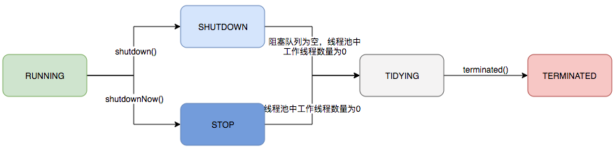

## 线程池
参考：
> https://mp.weixin.qq.com/s/28ThwQqMAumdSgaKDRWlBw
> https://developer.aliyun.com/article/784363

### 1、 Executors：提供了ThreadPool的简单实现
- ```newSingleThreadExecutor```：创建一个单线程化的线程池，保证所有任务按顺序执行
  - 参数：  
  corePoolSize=1  
  maximumPoolSize=1  
  BlockingQueue：```LinkedBlockingQueue```，无限长

- ```newCachedThreadPool```：可缓存线程池，线程池为无限大，线程可复用。
  - 参数：  
  corePoolSize=0  
  maximumPoolSize=INTEGER.MAX_VALUE
  BlockingQueue：```SynchronousQueue```，一个同步队列，该队列没有任何容量
  
- ```newFixedThreadPool```：创建一个定长线程池，可控制线程最大并发数，超出的任务会在队列中等待。
  - 参数：  
  corePoolSize=`输入决定` 
  maximumPoolSize=corePoolSize  
  BlockingQueue：```LinkedBlockingQueue```，无限长

- ```newScheduledThreadPool```：创建一个定长线程池，支持定时任务及周期性任务执行。


### 2、 ThreadPoolExecutor：
关键参数:  
```int corePoolSize```  
```int maximumPoolSize```  
```long keepAliveTime```	// 非核心线程空闲超时时间  
```TimeUnit unit```	// 存活时间单位  
```workQueue```：任务队列，即```BlockingQueue```。  
```ThreadFactory threadFactory```	// 新线程的产生方式  
```RejectedExecutionHandler handler``` // 拒绝策略  

- 当线程池小于`corePoolSize`时，新提交的任务会创建一个新的线程执行，技术此线程池中有空闲线程；
- 当线程池达到`corePoolSize`时，新提交的任务将被放入workQueue，等待线程池中任务调度执行；
- 当workQueue已满，并且`maximunPoolSize` > `corePoolSize`时，**新提交的任务会创建新的线程执行**；
- 当提交的任务数超过`maximunPoolSize`时，新提交的任务将被拒绝；
- 当线程池中超过`corePoolSize`线程，空闲时间达到`keepAliveTime`时，关闭空闲线程；
- 当线程池中设置`allowCoreThreadTimeOut=true`时，线程池中`corePoolSize`线程超过`keepAliveTime`时也将被关闭
> 总而言之，线程池的执行顺序是：**核心线程数 --> 等待队列 --> 最大线程数 --> 拒绝策略**

#### 2.1 allowCoreThreadTimeOut
```boolean allowCoreThreadTimeOut``` 
- true:核心线程如果空闲状态下，超过一定时间后就被销毁；
- 反之，false  
```java
// Set接口 
public void allowCoreThreadTimeOut(boolean value) {

}
// Get接口
public boolean allowsCoreThreadTimeOut() {
    return allowCoreThreadTimeOut;
}
```

#### 2.2 ```keepAliveTime```的取值
- keepAliveTime<0：报错，抛异常
- keepAliveTime=0：表示非核心线程执行完立刻终止。  
    注意：若allowCoreThreadTimeOut=true，则keepAliveTime=0会报错
- keepAliveTime>0：表示非核心线程当没有任务可以执行时，最多等待xx s，然后超时后结束该线程。

#### 2.3 ```corePoolSize=0```时，添加任务的行为
1. 将任务添加到队列queue中。如果成功执行步骤2，如果失败....略
2. 检查当前线程池是否有活动的线程。如果有，则判断结束；如果没有，则创建一个“非核心线程”来执行queue中的任务。
3. 扩展思考：Executors.newCachedThreadPool()接口创建的默认线程池参数是什么？为什么这样设置。


### 3、 线程池的状态：
- ```RUNNING```：运行状态，指可以接受任务并执行队列里的任务。
- ```SHUTDOWN```：调用了 shutdown() 方法，不再接受新任务，但队列里的任务会执行完毕。
- ```STOP```：指调用了 shutdownNow() 方法，不再接受新任务，所有任务都变成STOP状态，不管是否正在执行。该操作会抛弃阻塞队列里的所有任务并中断所有正在执行任务。
- ```TIDYING```：所有任务都执行完毕，程序调用 shutdown()/shutdownNow() 方法都会将线程更新为此状态，若调用shutdown()，则等执行任务全部结束，队列即为空，变成TIDYING状态；调用shutdownNow()方法后，队列任务清空且正在执行的任务中断后，更新为TIDYING状态。
- ```TERMINATED```：终止状态，当线程执行 terminated() 后会更新为这个状态。



1、```shutDown()``` 
当线程池调用该方法时,线程池的状态则立刻变成SHUTDOWN状态。此时，则不能再往线程池中添加任何任务，否则将会抛出RejectedExecutionException异常。但是，此时线程池不会立刻退出，直到添加到线程池中的任务都已经处理完成，才会退出。 

2、```shutdownNow()``` 
执行该方法，线程池的状态立刻变成STOP状态，并试图停止所有正在执行的线程，不再处理还在池队列中等待的任务，当然，它会返回那些未执行的任务。 
它试图终止线程的方法是通过调用```Thread.interrupt()```方法来实现的，但是大家知道，这种方法的作用有限，如果线程中没有```sleep``` 、```wait```、```Condition```、定时锁等应用, ```interrupt()```方法是无法中断当前的线程的。所以，ShutdownNow()并不代表线程池就一定立即就能退出，它可能必须要等待所有正在执行的任务都执行完成了才能退出。
     

### 4、 ```RejectedExecutionException```异常的两个原因：
1. 超出线程池```maximumPoolSize```的值
2. 调用```shutdown```结束线程池

--------

### 5、FAQ

**5.1 在线程池中，对于定时执行和延迟执行的任务，是如何实现定时和延迟的？**

**5.2 下列三种业务，应该如何使用线程池：**
并发高、任务执行时间短
并发不高、任务执行时间长
并发高、业务执行时间长

**5.3 如何复用线程**
- 向线程池中添加任务主要分三步：
    1. 如果当前线程数未超过核心线程数，则**创建一个新的核心线程**执行任务
    2. 如果当前线程数超过核心线程数，则**将任务加入阻塞队列**```BlockingQueue```中
    3. 如果队列已满，则在不超过最大线程数的情况下，创建新的线程执行任务
    4. 如果已达到最大线程数，则按照拒绝策略处理任务

开启一个线程，然后在线程中<font color=red>**开启while循环，不断的从阻塞队列中取任务**</font>。
如果出现没有任务可以处理时
- 对于核心线程：
    - 如果```allowCoreThreadTimeOut```为```true```，则通过```workQueue.poll(keepAliveTime)```取任务，**最后超时后线程执行结束**。
    - 如果```allowCoreThreadTimeOut```为```false```，则```workQueue.take()```会一直阻塞；
- 对于其他线程：
    - ```workQueue.poll(keepAliveTime)```**超时后线程执行结束**

**5.4 线程空闲时间超限如何判断**
通过线程池中的 BlockingQueue变量的 poll(timeout) 和 take() 接口。详见 5.3 

[《线程池是怎么回收空闲线程的？如果你认为有定时任务，那你就错了！》](https://www.jianshu.com/p/7f909bb27038)
[《简单分析ThreadPoolExecutor回收工作线程的原理》](https://www.cnblogs.com/kingsleylam/p/11241625.html)

**5.5 如何延迟执行任务**


