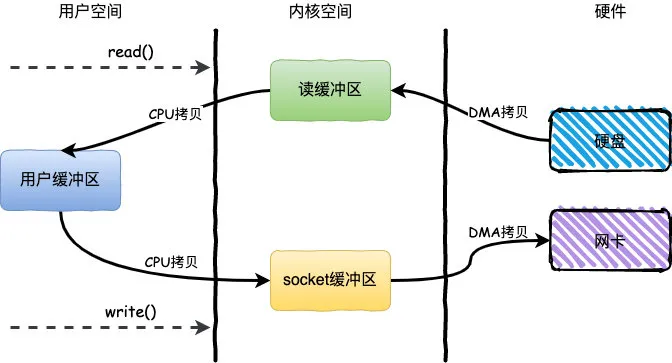

# Zero-copy 零拷贝

参考：  
[《面试官：什么是mmap？》](https://mp.weixin.qq.com/s/dXYQTofcP6lGR8SSctixBQ)  

## 1、使用传统IO方式进行读写的例子
基于传统的IO方式，底层实际上通过调用 ```read()``` 和 ```write()``` 来实现。  
举例：**读取文件，然后通过网络发送出去**  
这个流程可以简单的概括为：通过 ```read()``` 把数据从硬盘读取到内核缓冲区，再复制到用户缓冲区；然后再通过 ```write()``` 写入到socket缓冲区，最后写入网卡设备。  

**整个过程发生了 4 次用户态和内核态的上下文切换和 4 次拷贝**，具体流程如下：
1. 用户进程通过 ```read()``` 方法向操作系统发起调用，此时上下文从用户态转向内核态；
2. DMA 控制器把数据从硬盘中拷贝到读缓冲区；
3. CPU 把读缓冲区数据拷贝到应用缓冲区，上下文从内核态转为用户态，```read()``` 返回；
4. 用户进程通过 ```write()``` 方法发起调用，上下文从用户态转为内核态；
5. CPU 将应用缓冲区中数据拷贝到 socket 缓冲区；
6. DMA 控制器把数据从 socket 缓冲区拷贝到网卡，上下文从内核态切换回用户态，```write()``` 返回。


