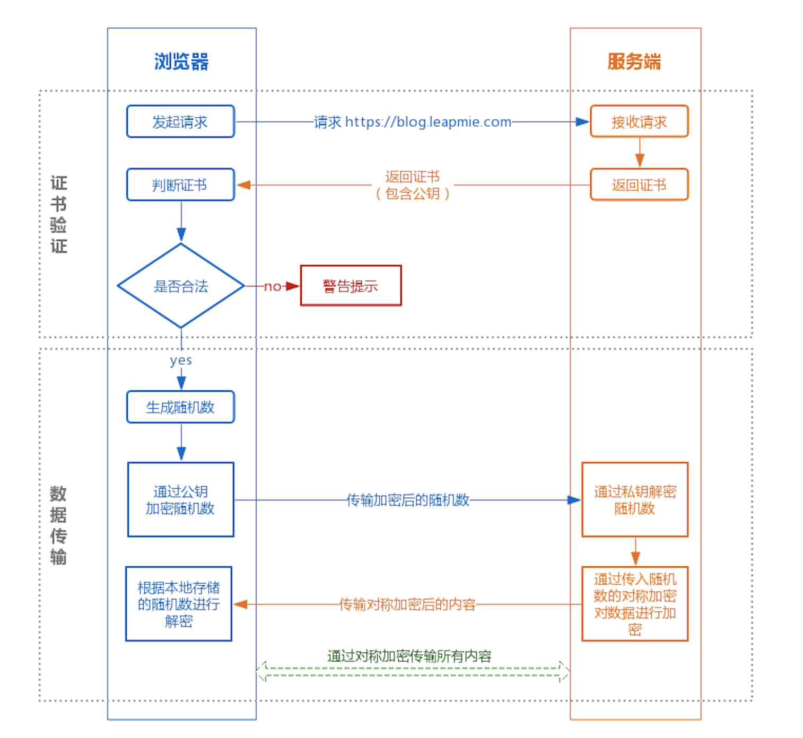
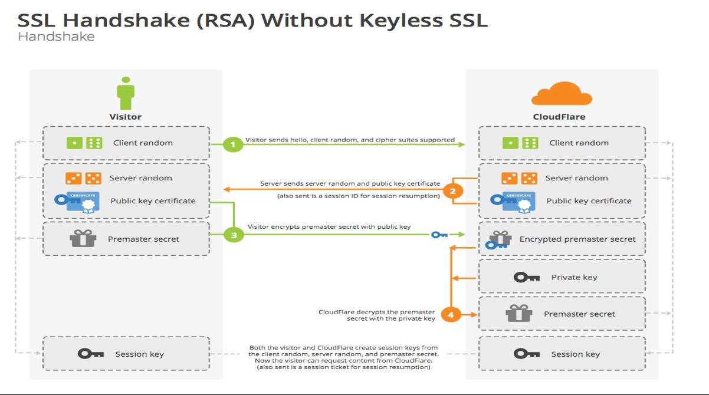
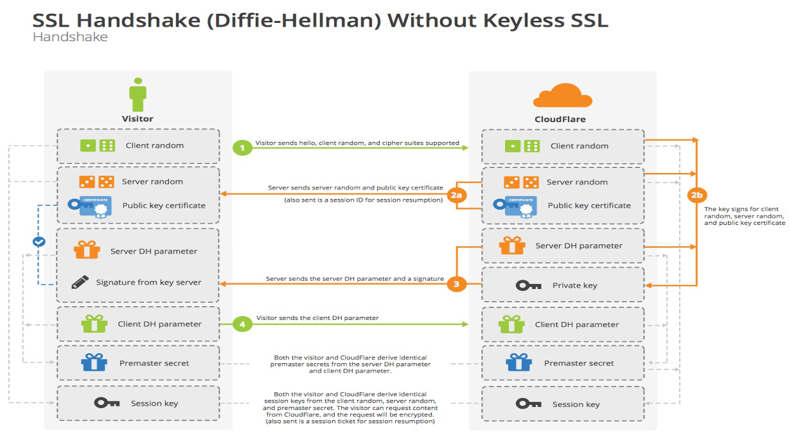
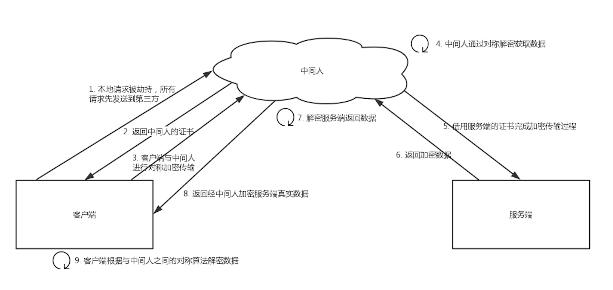

# HTTP协议

参考：

## 1、基本

### 1.1 报文组成
http报文由请求报文和响应报文两类组成

1. 请求报文：由`请求行`、`请求头`、`空行`、`请求体`四部分组成  
    `请求行`：包含http方法，请求地址，http协议以及版本
2. 响应报文：由`状态行`、`响应头`、`空行`、`响应体`四部分组成  
    `状态行`：包含http协议及版本、数字状态码、状态码英文名称  
    `请求头`/`响应头`：就是一些key:value来告诉服务端我要哪些内容，要注意什么类型等，请求头/响应头每一个字段详解  
    `空行`：用来区分首部与实体，因为请求头都是key:value的格式，当解析遇到空行时，服务端就知道下一个不再是请求头部分，就该当作请求体来解析了

### 1.2 优缺点

### 1.3 请求方法

### 1.4 `GET` 和 `POST` 的区别

### 1.5 请求头和响应头中的常见字段
- cache-control：

## 2、常见状态码
分类：  
- 1xx: 指示信息——表示请求已接收，继续处理
- 2xx: 成功——表示请求已被成功接收
- 3xx: 重定向——表示要完成请求必须进行进一步操作
- 4xx: 客户端错误——表示请求有语法错误或请求无法实现
- 5xx: 服务端错误——表示服务器未能实现合法的请求

例：

| 状态码 | 描述 |
| -- | -- |
| 200 | 请求成功
| 206 | 已完成指定范围的请求(带Range头的GET请求),场景如video,audio播放文件较大,文件分片时
| 301 | 永久重定向
| 302 | 临时重定向
| 304 | 请求资源未修改，可以使用缓存的资源，不用在服务器取
| 400 | 请求有语法错误
| 401 | 没有权限访问
| 403 | 服务器拒绝执行请求，场景：如不允许直接访问，只能通过服务器访问时
| 404 | 请求资源不存在
| 500 | 服务器内部错误，无法完成请求
| 503 | 请求未完成，因服务器过载、宕机或维护等

## 3、HTTPS 原理

### 3.1 HTTP握手的大致过程
- 使用RSA算法的HTTP握手过程：  

**详细描述：**  
**第一步**：Client 向 Server 发送：  
1. 客户端可以支持的SSL最高版本号
2. 一个客户端生成的随机数（**Client Random**）
3. 客户端支持的加密方法
4. 一个确定会话的会话ID
5. 一个客户端可以支持的密码套件列表（密码套件格式：每个套件都以“SSL”开头，紧跟着的是密钥交换算法。用“With”这个词把密钥交换算法、加密算法、散列算法分开，例如：SSL_DHE_RSA_WITH_DES_CBC_SHA,表示把DHE_RSA(带有RSA数字签名的暂时Diffie-HellMan)定义为密钥交换算法；把DES_CBC定义为加密算法；把SHA定义为散列算法）
6. 一个客户端可以支持的压缩算法列表

**第二步**：Server确认双方使用的加密方法，并给出数字证书、以及一个服务器生成的随机数（**Server Random**）。
发送内容：
1. 一个SSL版本号：取客户端支持的最高版本号和服务端支持的最高版本号中的较低者。
2. 一个用于生成主秘密的32字节的随机数。（客户端一个、服务端一个）
3. 会话ID
4. 从客户端的密码套件列表中选择的一个密码套件（SSL中密钥交换算法有6种：无效（没有密钥交换）、RSA、匿名Diffie-Hellman、暂时Diffie-Hellman、固定Diffie-Hellman、Fortezza。）
5. 从客户端的压缩方法的列表中选择的压缩方法
    至此：Client（客户端服务端）知道了下列内容
    SSL版本
    密钥交换算法、散列算法和加密算法
    压缩方法
    有关密钥生成的两个随机数

第三步：Client确认数字证书有效，然后生成一个**新的随机数（Premaster secret）**，并使用数字证书中的公钥，加密这个随机数，发给Server。

第四步：Server使用自己的私钥，获取Client发来的随机数，即Premaster secret。

第五步：Client和Server根据约定的加密方法，**使用前面的三个随机数，生成"对话密钥"（session key）**，用来加密接下来的整个对话过程。

注意：
1. 生成对话密钥一共**需要三个随机数**。  
2. 握手之后的对话使用 **"对话密钥"（对称加密）** 进行加密，服务器的公钥和私钥只用于加密和解密"对话密钥"（非对称加密）。因为非对称加密计算量大，而对称加密计算量小，效率高。整个对话过程中，服务器的公钥和私钥只需要用到一次。  
3. 如何保证公钥不被篡改？  
   服务器公钥放在服务器的数字证书之中。只要证书是可信的，公钥就是可信的。

- 使用DH算法的HTTP握手过程：
  

### 3.2 证书验证流程：

1. 使用CA公钥和声明的签名算法对CA中的签名进行解密，得到服务器公钥的摘要内容
2. 再用摘要算法对证书里的服务器公钥生成摘要，再把这个摘要和上一步得到的摘要对比：如果一致说明证书合法，里面的公钥也是正确的；否则就是非法的

### 3.3 SSL/TLS 单向认证和双向认证
单向认证：主要是客户端认证服务端的证书  
双向认证：服务器和客户端分别提供证书给对方，并互相验证对方的证书  

不过大多数https服务器都是单向认证，如果服务器需要验证客户端的身份，一般通过用户名、密码、手机验证码等之类的凭证来验证。只有更高级别的要求的系统，比如大额网银转账等，就会提供双向认证的场景，来确保对客户身份提供认证性

### 3.4 HTTPS不安全的地方
（一定可靠么）

### 3.5 HTTPS的性能优化
访问速度优化
计算性能优化

## 4、中间人攻击

**过程：**
1. 本地请求被劫持（如DNS劫持等），所有请求均发送到中间人的服务器
2. 中间人服务器返回中间人自己的证书
3. 客户端创建随机数，通过中间人证书的公钥对随机数加密后传送给中间人，然后凭随机数构造对称加密对传输内容进行加密传输
4. 中间人因为拥有客户端的随机数，可以通过对称加密算法进行内容解密中间人以客户端的请求内容再向正规网站发起请求
5. 因为中间人与服务器的通信过程是合法的，正规网站通过建立的安全通道返回加密后的数据中间人凭借与正规网站建立的对称加密算法对内容进行解密
6. 中间人通过与客户端建立的对称加密算法对正规内容返回的数据进行加密传输
7. 客户端通过与中间人建立的对称加密算法对返回结果数据进行解密

**攻击点：**
- 黑客通过特殊途径在被攻击者的设备上**安装根证书**
- 在上面的步骤2中，被攻击者在校验 黑客的公钥证书时，因为已经信任了黑客的**根证书**，所以会校验通过。
- 最后，本来C和S的通信，变成了被攻击者和黑客的通信

## 4、常用汇总

### 4.1 描述一次完整的网络请求
以浏览器为例：
1. Client构建请求
2. 查找缓存
3. DNS解析：准备目的IP和port，递归查找和迭代查询
4. 等待TCP队列（连接数量是有限制的，若同一时间有较多请求，则排队等待）
5. 建立TCP连接（三次握手）
6. 发起HTTP请求-Server处理请求-Server响应请求
7. 断开TCP连接（四次挥手）

### 4.2 正向代理和反向代理

