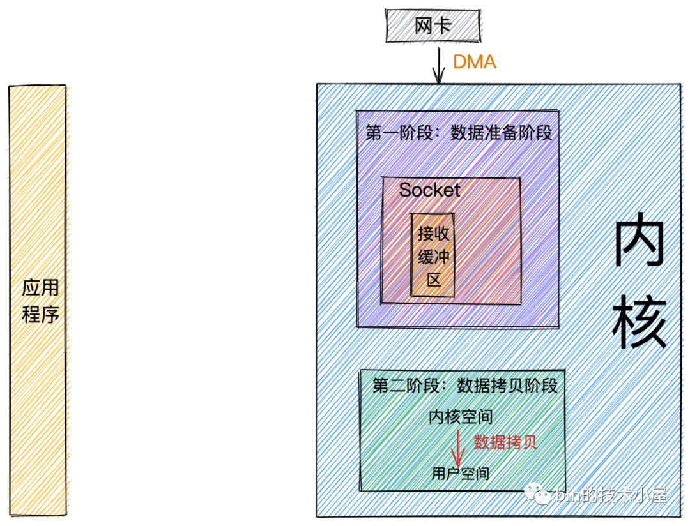

## IO模型
参考：
- [《Linux IO模式及 select、poll、epoll详解》](https://segmentfault.com/a/1190000003063859)  
- [《漫话：如何给女朋友解释什么是Linux的五种IO模型？》](https://mp.weixin.qq.com/s?__biz=Mzg3MjA4MTExMw==&mid=2247484746&idx=1&sn=c0a7f9129d780786cabfcac0a8aa6bb7)  
- [《聊聊Netty那些事儿之从内核角度看IO模型》](https://mp.weixin.qq.com/s?__biz=Mzg2MzU3Mjc3Ng==&mid=2247483737&idx=1&sn=7ef3afbb54289c6e839eed724bb8a9d6)  
- [《聊聊Netty那些事》](https://mp.weixin.qq.com/mp/appmsgalbum?__biz=Mzg2MzU3Mjc3Ng==&action=getalbum&album_id=2217816582418956300&scene=173)  
- [《聊聊Netty那些事儿之Reactor在Netty中的实现(创建篇)》](https://mp.weixin.qq.com/s?__biz=Mzg2MzU3Mjc3Ng==&mid=2247483907&idx=1&sn=084c470a8fe6234c2c9461b5f713ff30)  
- [《五种I/O 模式，select、epoll方法的理解，BIO、NIO、AIO理解 相关文章》](https://www.cnblogs.com/549294286/p/3739555.html)

linux系统产生了下面五种网络模式的方案。
- 阻塞 I/O（blocking IO）
- 非阻塞 I/O（nonblocking IO）
- I/O 多路复用（ IO multiplexing）
- 信号驱动 I/O（ signal driven IO）
- 异步 I/O（asynchronous IO）

注：由于signal driven IO在实际中并不

## 阻塞与非阻塞，同步和异步

以接收网卡的数据为例，可以把数据从“网卡”到“应用程序”整个过程看做两个阶段：
- 数据准备阶段：  
  在这个阶段，网络数据包到达网卡，通过DMA的方式将数据包拷贝到内存中，然后经过硬中断，软中断，接着通过内核线程ksoftirqd经过内核协议栈的处理，最终将数据发送到**内核Socket的接收缓冲区**中。
- 数据拷贝阶段：   
  当数据到达内核Socket的接收缓冲区中时，此时数据存在于内核空间中，需要将数据**拷贝到用户空间中**，才能够被应用程序读取。

注：`DMA控制器`可以看做一种将内部存储和外设连接起来的控制器。