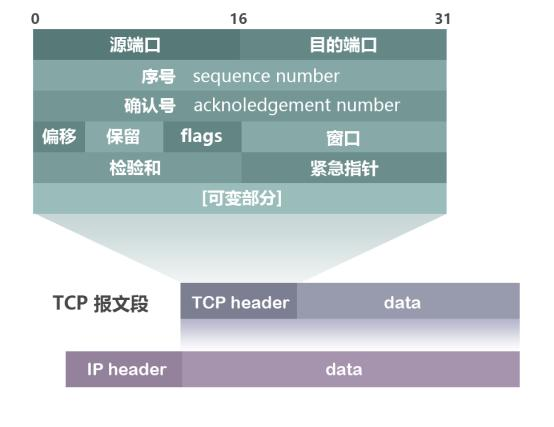
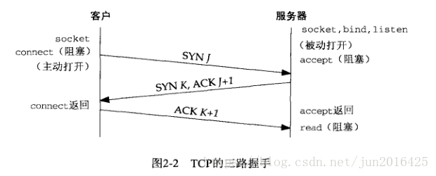
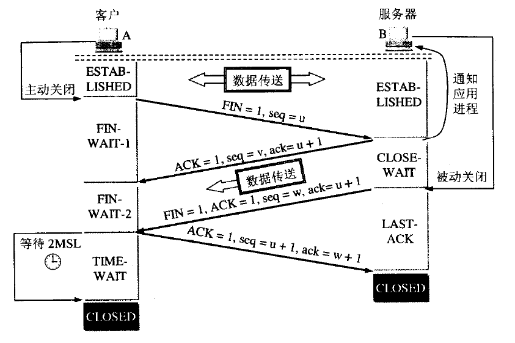

# Network

[两万字长文 50+ 张趣图带你领悟网络编程的内功心法](https://xie.infoq.cn/article/495e11547cc63794f693c1e73)


## TCP

协议头：


[一台Linux服务器最多能支撑多少个TCP连接?](https://mp.weixin.qq.com/s?__biz=MzA3ODIxNjYxNQ==&mid=2247495055&idx=1&sn=3cb81035df6f84d7e2238f0de349c261)

TCP连接四元组是```源IP地址、源端口、目的IP地址和目的端口```。任意一个元素发生了改变，那么就代表的是一条完全不同的连接了。

### 三次握手


注意：
1. 第一次握手：SYN 标记位（Flags）设置为1，seq=xxx
2. 第二次握手：SYN 和 ACK 标记位设置为1，seq=yyy，ack=xxx+1
3. 第三次握手：ACK 标记位设置为1，seq=xxx+1，ack=yyy+1

### 四次挥手



注意：
1. 第二次挥手的时候，ACK 设置为1，确认号ack=u+1
2. 第三次挥手的时候，FIN 和 ACK 设置为1，确认号ack=u+1

### 为什么在TIME-WAIT状态必须等待`2MSL`时间呢?
1. 如果最后一个ACK包对方没收到，那么对方在超时后将重发第三次握手的FIN包，主动关闭端接到重发的FIN包后可以再发一个ACK应答包。
2. 保证本连接持续的时间所产生的所有报文段都从网络中消失。这样就可以使下一个新的连接中不会出现这种旧的连接请求的报文段。 


```MSL```：是`Maximum Segment Lifetime`英文的缩写，中文可以译为“报文最大生存时间”，他是任何报文在网络上存在的最长时间，超过这个时间报文将被丢弃。  
```TTL```：是`time to live`的缩写，中文可以译为“生存时间”。ip头中有一个TTL域，这个生存时间是由源主机设置初始值但不是存的具体时间，而是存储了一个ip数据报可以经过的最大路由数，每经过一个处理他的路由器此值就减1，当此值为0则数据报将被丢弃，同时发送ICMP报文通知源主机。RFC 793中规定MSL为2分钟，实际应用中常用的是30秒，1分钟和2分钟等。  
```RTT```：`round-trip time`，简称RTT，是客户到服务器往返所花时间，TCP含有动态估算RTT的算法。  

### 拥塞控制


### 流量控制


