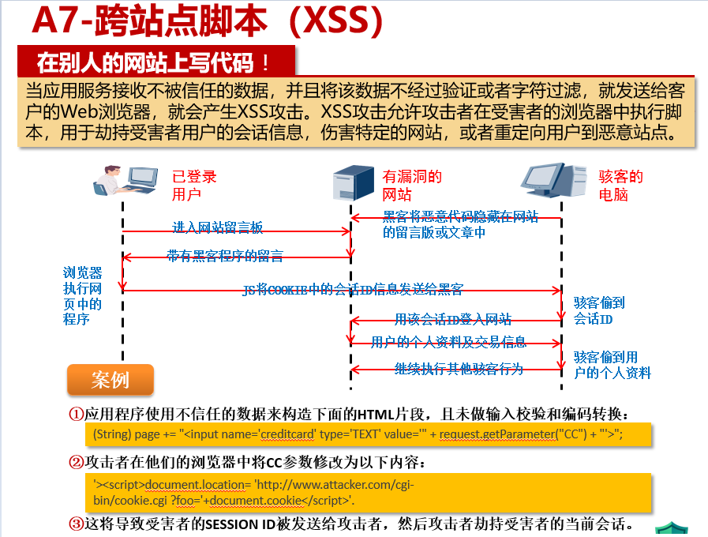

## Security 安全

### 1、名词
- XSS（跨站点脚本） 漏洞：
  当应用服务接收不被信任的数据，并且将该数据不经过验证或者字符过滤，就发送给客户的Web浏览器，就会产生XSS攻击。XSS攻击允许攻击者在受害者的浏览器中执行脚本，用于劫持受害者用户的会话信息，伤害特定的网站，或者重定向用户到恶意站点。

- XXE（XMLW外部实体）漏洞：
  XML处理器评估了XML文件中的外部实体引用
