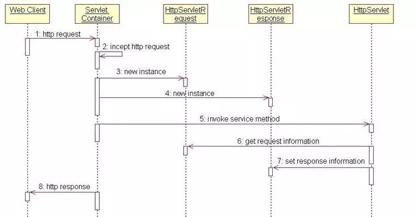
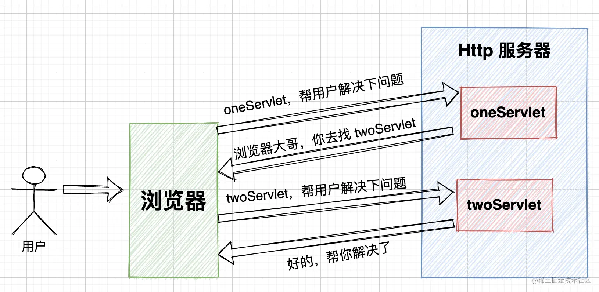
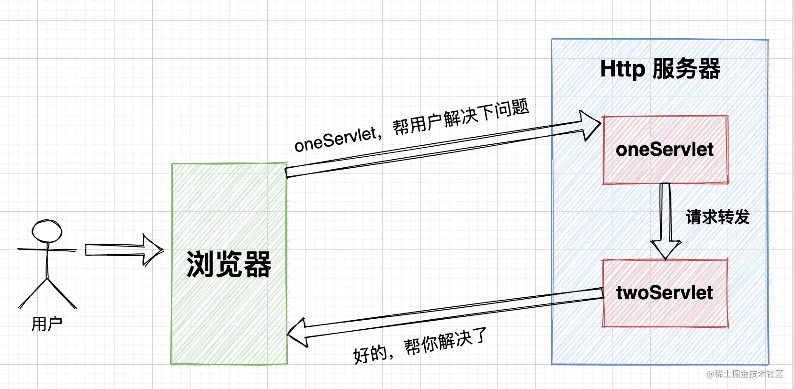

## JSP与Servlet
参考：
> [《走进JavaWeb技术世界4：Servlet 工作原理详解》](https://github.com/h2pl/Java-Tutorial)  
> [《Servlet 原来是这个玩意！看完恍然大悟！》](https://juejin.cn/post/7041784126701043749)  


提供一个统一的web应用的规范：开发者统一的使用这种规范来编写Web应用，应用容器也需要遵守这样的规范为Web应用提供服务。  
Java提供的`Servlet`类，将HTTP中那些低层的结构进行了包装，使Web应用开发更加方便。
Web容器为Servlet提供运行时环境：加载`Servlet`，并管理其生命周期。

### 1、JSP与Servlet的区别
1. `.jsp文件`经Web容器编译后就变成了`Servlet`，即 **`JSP`的本质就是`Servlet`**。
   - 因为`JVM`只能识别java的类，不能识别JSP的代码，所以**Web容器将JSP的代码编译成JVM能够识别的java类**。
2. `Jsp`更擅长表现于页面显示，`Servlet`更擅长于逻辑控制。
   - `Jsp`是`Servlet`的一种简化，就像“在静态HTML内容中嵌入Java代码”
   - `Servlet`只能使用页面输出流逐行输出，即不断的拼接HTML内容（维护困难、可读性差）

### 2、`Servlet`的生命周期
1. `Servlet` 通过调用`init(ServletConfig)`方法进行初始化。
   - 创建`Servlet`对象时被调用，且在整个生命周期中只调用一次。
   - 一个`Servlet`在Web容器**只存在一个实例**，
   - 默认情况下，在第一次被访问时加载到内存并实例化的；也可以修改`web.xml`配置，在Web容器启动时进行实例化。
2. `Servlet` 调用 `service(ServletRequest req,ServletResponse res)` 方法来处理客户端的请求。
   - `service()`方法是执行实际任务的主要方法。
   - 每次接收到一个请求时，Web容器都会**产生一个新的线程**并调用`service()`方法处理来自客户端的请求，并将结果返回给客户端。
3. `Servlet` 通过调用 `destroy()` 方法终止（结束）。
   - 销毁`Servlet`对象时被调用，且在整个生命周期中只调用一次
   - `Servlet` 是由 JVM 的垃圾回收器进行垃圾回收的。

### 3、Servlet单实例多线程机制：

`Servlet`容器一个工作线程池+调度线程来处理请求的：当容器收到一个`Servlet`请求，调度线程从线程池中选出一个工作者线程，将请求传递给该工作者线程，然后由该线程来执行`Servlet`的`service()`方法。  
当容器同时收到对同一个`Servlet`的多个请求时，这个`Servlet`的`service()`方法将**在多线程中并发执行**。因此，在Service中处理业务逻辑时，需要特别注意多线程的问题  
对于Tomcat可以在`server.xml`中通过元素设置线程池中线程的数目。   

### 4、Servlet工作原理时序



1. Client向Servlet容器（Tomcat）发出Http请求；
2. Servlet容器接收Client的请求；
3. Servlet容器创建一个`HttpRequest`对象，将Client请求的信息封装到这个对象中；
4. Servlet容器创建一个`HttpResponse`对象；
5. Servlet容器调用HttpServlet对象的`service()`方法，把`HttpRequest`对象与`HttpResponse`对象作为参数传给 HttpServlet对象；  
    - 如果是继承的HttpServlet，那么就会将`service()`方法进一步分拆成`doPost()`和`doGet()`等方法执行
6. HttpServlet调用`HttpRequest`对象的有关方法，获取Http请求信息；
7. HttpServlet调用`HttpResponse`对象的有关方法，生成响应数据；
8. Servlet容器把HttpServlet的响应结果传给Client；


### 5、重定向与请求转发

#### 5.1 重定向


举例：继承```HttpServlet```，调用```HttpServletResponse```的接口：

```java
// 方式一：参数为重定向 “设置的路径”
response.sendRedirect("/f1/second-servlet");

// 方式二：手动设置头部信息
response.setHeader("Location","设置的路径");
response.setStatus(302);
```

**重定向的路径问题：**  
- 如果以`/`开头，则表示从**Servlet容器（而不是当前webapp）的根路径**进行重定向  
- 如果没有以`/`开头，则表示从当前页面的相对路径进行重定向  

#### 5.2 请求转发


举例：继承```HttpServlet```

```java
// 方式一：调用 HttpServletRequest 的接口
// 参数为请求转发的路径
request.getRequestDispatcher("/second-servlet").forward(request, response);

// 方式二：调用 ServletContext 的接口
this.getServletContext().getRequestDispatcher("/second-servlet").forward(request, response);

```

**重定向的路径问题：**  
- 如果以`/`开头，则表示从**当前webapp的根路径**进行请求转发   
- 如果没有以`/`开头，则表示从当前页面的相对路径进行请求转发   


#### 5.3 【面试】“重定向”与“请求转发”两者比较（重要）


### 6、Servlet 之间数据共享

#### 6.1 ServletContext
**一个Web app只有一个```ServletContext```对象**，即这个对象是多个Servlet之间共享的。  

**常用API举例：**
```java
// 0. 获取 ServletContext对象
ServletContext servletContext = this.getServletContext();

// 1. 共享参数
servletContext.setAttribute("myKey", 123456);
Object obj = servletContext.getAttribute("myKey");

// 2. 获取初始化参数
//    背景：在web.xml中存在如下配置：
//    <context-param>
//        <!--配置参数-->
//        <param-name>myParam</param-name>
//        <param-value>Zero-Value</param-value>
//    </context-param>
servletContext.getInitParameter("myParam");

// 3. 请求转发
servletContext.getRequestDispatcher("请求路径").forward(request, response);

// 4. 取配置属性。
// 关键：注意配置文件的路径,
// 必须以`/`开头，表示从当前webapp的根路径进行请求转发 
InputStream in = servletContext.getResourceAsStream("/WEB-INF/classes/config/r2.properties");
// 使用Java方法读取配置文件
Properties properties = new Properties();
properties.load(in);
String user = (String) properties.get("username");

```

#### 6.2 Cookie
`Cookie` 是 Servlet 规范中的一个对象。
- 当`浏览器Client`访问`FirstServlet`时，`FirstServlet`会创建一个存储该`Client`信息的`Cookie`，然后写入响应头并返回给`Client`。
- 浏览器`Client`获取响应后，将`Cookie`存储到**浏览器缓存**中
- **当同一个`浏览器Client`**访问`SecondServlet`时，Http请求头中会携带`Cookie`信息，那么`SecondServlet`就会解析到对应的用户数据。

##### **6.2.1 常用API举例：**
```java

// 1. 获取request中的所有cookie
Cookie[] cookies = request.getCookies();
for (Cookie cookie: cookies){
    // 获取cookie的信息
    String c = "cookie.getName() = " + cookie.getName() + ", cookie.getValue() = " + cookie.getValue();
    out.println(c);
}

// 2. 创建并添加一个新的cookie，返回给Client
Cookie myCookie = new Cookie("MyCookName", "balabala");
response.addCookie(myCookie);

```
##### 6.2.2 字符问题：
在Cookie中，某些特殊的字符，例如：`空格，方括号，圆括号，等于号（=），逗号，双引号，斜杠，问号，@符号，冒号，分号`都不能作为Cookie的内容。
所以，
- 在添加cookie的时候，可以将value字段通过```URLEncoder.encode(msg,"utf-8");```进行编码
- 在获取cookie的时候，可以将value字段通过```URLDecoder.decode()(msg,"utf-8");```进行解码

#### 6.3 Session
`Session` 是 Servlet 规范中的一个对象。
- 当`浏览器Client`访问`FirstServlet`时，`FirstServlet`会创建一个存储该`Client`信息的`Session`。
- **当同一个`浏览器Client`**访问`SecondServlet`时，`SecondServlet`通过服务器Server内存中保存的对应的**Session（SessionId相同）**，获取到对应的用户数据。
- 换一个浏览器、重启浏览器或者Session失效后，再次访问webapp时，**会重新生成一个新的Session（和之前的SessionId不同）**
- SessionId的原理：Cookie中的一个name为JSESSIONID的特殊Cookie

**常用API举例：**
```java
// 1. 获取session对象
HttpSession session = request.getSession();

// 2. 存取session中的值
session.setAttribute("myName", student);
session.getAttribute("myName");

// 3. 强制session失效
session.invalidate();

```

```xml
<!-- 设置超时时间（单位：min） -->
<web-app>
    <!-- 其他...略 -->
    <session-config>
        <!-- 1. 如果小于等于0，表示永远不会超时 -->
        <!-- 2. 如果未指定，则使用web容器默认的值 -->
        <session-timeout>5</session-timeout>
    </session-config>
</web-app>
```


#### 6.4 【面试】Cookie与Session两者比较（重要）


### 7、过滤器```Filter```
#### 7.1 基本使用：
类比Servlet的用法
1. 实现```javax.servlet.Filter```类，并实现相关方法
   1. ```init```方法：在启动web容器的时候调用
   2. ```doFilter```方法：
        被过滤器拦截的请求，都会执行一次这个方法。执行完操作后，执行`filterChain`的`doFilter()`方法，将req和rep继续传递下去；否则操作在此终止，server将rep返回给客户端。
   3. ```destroy```方法：关闭web容器的时候调用
2. 在```web.xml```中创建标签
```<filter></filter>```
```<filter-mapping></filter-mapping>```
3. 设置标签属性，表示适配场景
```<url-pattern></url-pattern>``` 或 ```<servlet-name></servlet-name>```


例：乱码时，增加Spring的字符过滤器
```xml
    <!--    配置 spring mvc的字符过滤器，解决乱码-->
    <filter>
        <filter-name>encoding-filter</filter-name>
        <filter-class>org.springframework.web.filter.CharacterEncodingFilter</filter-class>
        <init-param>
            <param-name>encoding</param-name>
            <param-value>utf-8</param-value>
        </init-param>
    </filter>
    <filter-mapping>
        <!--  注意此时通配符使用 /*      -->
        <filter-name>encoding-filter</filter-name>
        <url-pattern>/*</url-pattern>
    </filter-mapping>
```

#### 7.2 原理：责任链模式
注意类比OKHTTP的责任链模式的使用

### 8、监听器```Listener```

观察者模式？？？

#### 8.1 基本使用:以 HttpSessionListener 为例
1. 实现```HttpSessionListener```接口，```override```相关方法
2. 在```web.xml```中创建标签
```xml
<listener>
    <listener-class>org.xxxx.MyListener</listener-class>
</listener>
```

### 9、Interceptor拦截器


### FAQ：

### 告诉浏览器，x秒后重新请求一次（刷新）
```java
response.setHeader("refresh","2");
```

