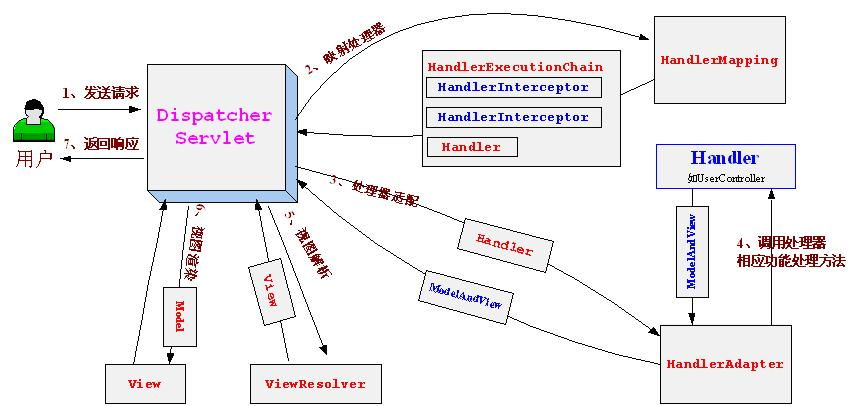

## SpringMVC
参考：
[Spring MVC官方文档](https://docs.spring.io/spring-framework/docs/current/reference/html/web.html#spring-web)  
[Spring MVC中文文档](https://books.didispace.com/spring-mvc-4-tutorial/publish/21-1/introduction-to-spring-web-mvc-framework.html)

### MVC 思想


### SpringMVC 执行原理


1. 发起请求到`前端控制器(DispatcherServlet)`
2. 前端控制器请求`处理器映射器(HandlerMapping)`查找Handler(可根据xml配置、注解等方式进行查找)
3. `HandlerMapping`向`DispatcherServlet`返回Handler
4. `DispatcherServlet`调用`处理器适配器(HandlerAdapter)`执行Handler
5. `处理器适配器(HandlerAdapter)`去执行Handler(Handler中用来实现具体的业务逻辑，一般为Controller)
6. Handler执行完，给`HandlerAdapter`返回`ModelAndView`(Springmvc框架的一个底层对象)
7. `HandlerAdapter`向`DispatcherServlet`返回`ModelAndView`
8. `DispatcherServlet`请求`视图解析器(ViewResolver)`进行视图解析，根据逻辑视图名解析成真正的视图(jsp)
9. `ViewResolver`向`DispatcherServlet`返回View
10. `DispatcherServlet`进行视图渲染，即将(在ModelAndView对象中的)模型数据填充到request域中
11. `DispatcherServlet`向用户响应结果


#### `DispatcherServlet` 前端控制器
SpringMVC核心组件，主要步骤为：
1. 从用户发来的请求都会走到这个前端控制器
2. 前端控制器找到对应的Controller
3. 交给Controller执行具体业务
4. 将Controller返回的ModelAndView传给ViewResolver进行解析和渲染

与前端控制器相配合的三个组件：
1. 处理映射器`HandlerMapping`
   如: `BeanNameUrlHandlerMapping`
2. 处理适配器`HandlerAdapter`
   如: `SimpleControllerHandlerAdapter`
3. 视图解析器`ViewResolver`
```xml
<!--    视图解析器-->
<bean class="org.springframework.web.servlet.view.InternalResourceViewResolver" id="InternalResourceViewResolver">
    <!-- 前缀：注意结尾的 /  -->
    <property name="prefix" value="/WEB-INF/jsp/"/>
    <!-- 后缀: -->
    <property name="suffix" value=".jsp"/>
</bean>
```

#### ViewResolver 视图解析器
视图解析器：负责解析`DispatcherServlet`传过来的`ModelAndView`
1. 获取`ModelAndView`中的数据
2. 解析`ModelAndView`中的视图`View`名称
3. 拼接视图的名称，找到对应的视图：前缀+名称+后缀
4. 将数据渲染到这个视图上


### 如何创建一个Controller
方式一：
1. 实现Controller接口，并 override handleRequest方法
2. 在handleRequest方法中创建一个需要ModelAndView对象并返回
3. 在spring配置文件中，将该Controller注册为一个bean，bean的Id就是访问的子路径

方式二：使用注解（推荐）


### FAQ：
#### 配置前端控制器
```xml
<web-app >

<!-- 略 -->

    <servlet>
        <servlet-name>my-spring-servlet</servlet-name>
        <servlet-class>org.springframework.web.servlet.DispatcherServlet</servlet-class>
        <!-- 绑定spring的配置文件 -->
        <init-param>
            <param-name>contextConfigLocation</param-name>
            <param-value>classpath:springmvc-config.xml</param-value>
        </init-param>
        <!--   配置启动级别（可选）：1：应用启动时自动加载     -->
        <load-on-startup>1</load-on-startup>
    </servlet>

    <!--
      在SpringMVC中：
      /  :表示只匹配所有请求，不去匹配jsp页面
      /* :匹配所有请求，也匹配jsp页面
      -->
    <servlet-mapping>
        <servlet-name>my-spring-servlet</servlet-name>
        <url-pattern>/</url-pattern>
    </servlet-mapping>
</web-app>

```
#### 配置 spring配置文件
```xml
<beans >

<!-- 略... -->

    <!--    开启自动扫描-->
    <context:component-scan base-package="org.helloseries.spring.controller"/>
    <!--    让Spring MVC不处理静态资源？？？ .css .js .html.mp3 .mp4-->
    <mvc:default-servlet-handler/>
    <!--    开启注解支持: 处理映射器HandlerMapping  处理适配器HandlerAdapter 会自动的被配置-->
    <mvc:annotation-driven/>
    <!--    配置视图解析器-->
    <bean class="org.springframework.web.servlet.view.InternalResourceViewResolver">
        <property name="prefix" value="/WEB-INF/jsp/"/>
        <property name="suffix" value=".jsp"/>
    </bean>


</beans>
```

### FAQ:
HTTP Post请求时，增加参数

