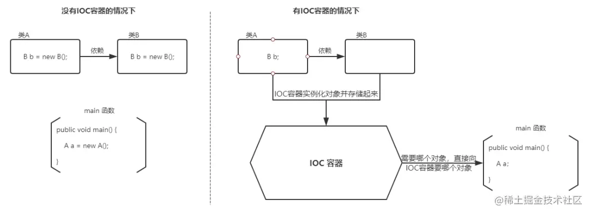

# Spring基础
参考：
[《深入浅出Spring 框架，原来以前白学了！》](https://juejin.cn/post/7095532056632885284)
[《spring bean是什么》](https://www.awaimai.com/2596.html)  
[《Spring Boot、Spring MVC 和 Spring 有什么区别》](https://juejin.cn/post/7024855197931274276)  
[《Servlet 到 Spring MVC 的简化之路》](https://juejin.cn/post/6844903570681135117)  
[《Nice！终于有人把SpringMVC讲明白了》](https://juejin.cn/post/6992383622342770695)  

## 1、集合

### 什么是```Bean```
在 Spring 中，构成应用程序主干并由Spring IoC容器管理的对象称为 Bean。Bean 是一个根据bean规范编写出来的类并由Spring IoC容器实例化、组装和管理的对象。

概念简单明了，我们提取处关键的信息： 
- bean是Java对象，一个或者多个不限定
- bean由Spring中一个叫IoC容器的东西管理
- Bean容器，或称Spring Ioc容器，主要用来管理对象和依赖，以及依赖的注入
- 我们的应用程序由一个个bean构成
- POJO泛指普通的Java对象。Bean可以简单理解为，满足特定编写规范的Java对象

### Bean的作用域  
参考：
> https://docs.spring.io/spring-framework/docs/current/reference/html/core.html#beans-factory-scopes  
- singleton：单例模式，默认。Spring容器中只有一个对象
- prototype：原型模式，每次从Spring容器中get时，都会返回不同的bean对象
如：```<bean id="myBean" class="org.helloseries.spring.dao.myBean" scope="prototype"/>```
- request
- session
- application
- websocket

### 什么是```Servlet```
 官方解说: Servlet 是运行在 Web 服务器上的程序，它是作为来自 HTTP 客户端的请求和 HTTP 服务器上的应用程序之间的中间层。
 Servlet 需要在Web容器中运行，并且由Web容器维护其生命周期。
 web容器默认是采用单Servlet实例多线程的方式处理多个请求的

 ### 什么是 SSH框架 和 SSM框架
 SSH = Structs2 + Spring + Hibernate
 SSM = SpringMVC + Spring + Mybatis

 

## 什么是控制反转IoC
控制反转英文全称：Inversion of Control，简称就是IoC，是一种思想。 
**控制**，即由谁来控制对象的创建和管理；**反转**，即由传统的程序进行控制，变成了由Spring容器进行控制。
所以，控制反转是指**不通过 new 关键字来创建对象，而是通过 IoC 容器(Spring 框架) 来帮助我们实例化对象**。
实现IoC的方法有很多，依赖注入（DI）方式是其中之一。  


注：两方之间不互相依赖，由第三方容器来管理相关资源

## 什么是AOP
面向切面编程（Aspect oriented programming，AOP），AOP 是 OOP（面向对象编程）的一种延续。
AOP 主要用来解决：在不改变原有业务逻辑的情况下，增强横切逻辑代码（常用的场景包括：事务控制、权限校验、日志等等），降低耦合。

### 什么是Restful
Restful是一种资源定位及资源操作的一种风格，不是一种协议。使用Restful风格进行开发，可以使系统更加简洁、更加有层次
优点：简洁、高效、安全


## 2、Bean的装配
参考：
[《初识Spring —— Bean的装配（一）》](https://juejin.cn/post/6844903618567471112)

在Spring中有几种装配Bean的方式：

### 2.1 XML装配：在XML中显式配置：
创建 ```spring-bean.xml```（配置文件名字随意）
```xml
<beans>
    ...略

    <!-- 例1： -->
    <!-- 添加配置  id：Bean的唯一标识；class：Bean的完整名称 -->
    <!-- name: Bean的别名，可以同时取多个别名（空格 逗号 分好进行分割），等同于 <alias/>标签 -->
    <bean id="xxx" class="xxx.xxx.xxx" name="myAliasName,myAliasName2"/>

    <!-- 例2： -->
    <bean id="myBean" class="org.helloseries.spring.service.MyBeanImpl">
        <!-- ref : 赋值为Spring 容器中定义的bean对象 -->
        <property name="dao" ref="myDao"/>
        <!-- value : 赋值为基本数据类型 -->
        <property name="dao" value="123"/>
    </bean>

    <!-- 为Bean指定一个别名，这样就可以通过别名进行访问 -->
    <alias name="myBean" alias="myAliasName"/>
</beans>
``` 


### 2.2 自动装配

**2.2.1 方式一：在Bean的定义中增加`autowire`属性，并指定装配策略**
- byName：需要保证Bean的id值唯一
- byType：需要保证Bean的class值唯一

根据名称或者类型进行匹配。这些Bean要先定义，后面Bean装配的时候才能使用

```xml
<beans>
    ...略
    <!-- 在Spring容器中查找，匹配 “Bean Id” 和 “Set方法中指定属性的名称”，然后装配给这个Bean-->
    <bean id="xxx" class="xxx.xxx.xxx" autowire="byName"/>

    <!-- 在Spring容器中查找，匹配 “Bean的类型” 和 “Set方法中指定属性的类型”，然后装配给这个Bean-->
    <bean id="xxx" class="xxx.xxx.xxx" autowire="byType"/>
</beans>
``` 

**2.2.2 方式二：注解的自动装配**  
Spring 2.5 开始支持。  
参考：
> https://docs.spring.io/spring-framework/docs/current/reference/html/core.html#beans-annotation-config  

使用步骤：
1. 导入约束
2. 配置xml，开启注解的能力  


```xml
<?xml version="1.0" encoding="UTF-8"?>
<beans xmlns="http://www.springframework.org/schema/beans"
    xmlns:xsi="http://www.w3.org/2001/XMLSchema-instance"
    xmlns:context="http://www.springframework.org/schema/context"
    xsi:schemaLocation="http://www.springframework.org/schema/beans
        https://www.springframework.org/schema/beans/spring-beans.xsd
        http://www.springframework.org/schema/context
        https://www.springframework.org/schema/context/spring-context.xsd">

    <!-- 开启注解能力的支持 -->
    <context:annotation-config/>

</beans>
```

3. 在属性上增加```@Autowired```注解
- ```@Autowired```注解可以应用在类中的属性上，
- ```@Autowired```注解可以应用在属性的Setter方法上
- 被```@Autowired```修饰的属性可以不配置Getter和Setter方法，即使该属性是private的（使用反射实现的）
- 被```@Autowired```修饰的属性，Spring容器在自动注入的时候，根据 byType 和 byName 结合来寻找的

4. 扩展
- 与```@Qualifier()```组合，可以手动的显式指定自动装配的Bean，如：
```java
    @Autowired
    @Qualifier(value = "myBeanId")
    private IMyDao dao;
```
- ```@Resource```注解可以代替```@Autowired```注解，实现自动注入
- ```@Resource(value = "xxx")```注解可以代替```@Autowired``` + ```@Qualifier("xxx")```注解，实现自动注入
如：
```java
    @Resource(name = "myBeanId")
    private IMyDao dao;
```

- ```@Nullable``` 被注解的元素可以为null 
- ```@NonNull``` 被注解的元素不能为null
- ```@Autowired(required = false)```中required参数的意义


### 2.3 Java装配：在Java中显式的配置
参考：
> https://docs.spring.io/spring-framework/docs/current/reference/html/core.html#beans-java

1. 使用```@Configuration```注解修饰一个类， 
被```@Configuration```修饰的类的作用和xml配置文件的作用一样,即```<beans></beans>```大标签

2. 增加```@ComponentScan```注解，开启自动扫描
   在指定的包下面，被```@Component```修饰的类会被注册成Bean

3. 使用```@Bean```修饰的方法
   相当于配置了一个```<bean/>```标签。  
   默认情况下，“将该方法名的首字母小写”的值就是这个Bean的Id
   这个方法的返回值类型，就是Bean的Class
   这个方法的返回值，就是被注入Bean
   如：
    ```java
    @Configuration
    @ComponentScan("org.helloseries.spring")
    public class MyConfig {
        @Bean
        public MyServiceImpl getMyService(){
            return new MyServiceImpl();
        }
    }
    ```

4. 使用```AnnotationConfigApplicationContext```读取config类的的配置。如：
   ```java
        ApplicationContext context = new AnnotationConfigApplicationContext(MyConfig.class);
        MyServiceImpl myService = (MyServiceImpl) context.getBean("myServiceImpl");
        System.out.println(myService.getMyDao().getName());
   ```

5. 使用`@Import(xxx.class)`注解可以引入其他的配置文件
   类比xml配置中的```<import/>```标签

## 3、处理响应

### 3.1 使用ModelAndView，可同时返回数据和视图
使用```@Controller```修饰的类，如
```java
@Controller
public class TestController {

    @RequestMapping("/test")
    public String getTest(Model model) {
        // 该方法的参数可以很灵活，详见requestMapping的用法
        model.addAttribute("msg","hfllgslgj");
        // 返回一个视图名称
        return "testPage";
    }

    @RequestMapping("/test2")
    public ModelAndView test2() {
        // 通过 ModelAndView 设置一个视同名称
        ModelAndView mv = new ModelAndView();
        mv.addObject("myMsg","3453353");
        mv.setViewName("testPage");
        return mv;
    }
}
```
### 3.2 返回的String直接响应给客户端:
    1. 使用`@ResponseBody`修饰类或者方法
    2. 使用`@RestController`修饰类
```java
@Controller
public class TestController {

    @RequestMapping("/test")
    @ResponseBody
    public String getTest(Model model) {
        // 该方法的参数可以很灵活，详见requestMapping的用法
        model.addAttribute("msg","hfllgslgj");
        // 返回一个视图名称
        return "testPage";
    }
}
```


## 4、Spring中的配置文件
参考案例：[《spring配置文件》](https://www.jianshu.com/p/ab809c13c8a8)

### 4.1 Spring的配置文件<import/>标签
作用：引入多个配置文件，合并到一个总的配置文件中
如：
- applicationContext.xml
```xml
<beans>
    <import resource="myConfig1.xml" />
    <import resource="myConfig2.xml" />
    <import resource="myConfig3.xml" />
</beans>
```
- myConfig1.xml
- myConfig2.xml
- myConfig3.xml

若多个配置文件中出现相同的条目，则如何覆盖？？？

### 4.2 web.xml
1. web.xml文件是我们开发Web程序的一项很重要的配置项，里面包含了我们各种各样的配置信息，比如欢迎页面，过滤器，监听器，启动加载级别等等。
2. 在tomcat容器启动后，会寻找项目中的web.xml文件，加载其中的信息，并创建一个ServletContext上下文对象，以后再web应用中可以获得其中的值。
3. 在web.xml文件中配置`<servlet/>`和`<servlet-mapping/>`标签，可以指定spring mvc的配置文件（如下面的4.4小节的文件）

web.xml中的加载顺序是：`context-param -> listener -> filter > servlet`

### 4.3 applicationContext.xml
约定的文件名？？？

### 4.4 springMvc.xml
web项目启动时，读取web.xml配置文件，首先解析的是applicationContext.xml文件，其次才是spingMvc.xml文件。
spingMvc.xml文件中主要的工作是：启动注解、扫描controller包注解；静态资源映射；视图解析（defaultViewResolver）；文件上传（multipartResolver）;返回消息json配置。


## 常用注解

### ```@Configuration```和```@ContextConfiguration```相关：  
如：```@ContextConfiguration(classes = CDPlayerConfig.class)```

读取属性的方法
- 方式一：作用于整个类，为相同名称的字段赋值（该字段需要Getter和Setter）
```@ConfigurationProperties(prefix = "custom.const")```

- 方式二：作用于某一个具体的属性，单独为该属性赋值
```@Value("${xxx.xxx.xxx}")```


### Controller 相关
案例参考：[《Controller方法返回值以及部分注解的使用》](https://zhuanlan.zhihu.com/p/42790384)
- ```@Controller```：修饰类和方法
- ```@ResponseBody```：修饰类和方法。**若方法返回String，则将这个字符串直接返回请求方，而不是表示一个视图**
- ```@RestController```：等于 @Controller + @ResponseBody

### RequestMapping 相关
```@RequestMapping```这个注解可以作用在方法上或者是类上，用来指定请求路径。如果用于类上,表示类中的所有响应请求的方法都是以该地址作为父路径
- `value` 或 `path` ：添加子路径
- `method` ： 规定Http的请求方法
- 衍生：`@GetMapping` `@PostMapping` `@DeleteMapping` `@PutMapping`... = `@RequestMapping` + `method`属性

#### 被```@RequestMapping```修饰的方法的参数
**情况一：自动匹配**
- Http GET方法+方法参数是基本数据类型：方法参数名 = Http请求中的参数名
- Http GET方法+方法参数是一个对象：Http请求中的参数名将自动匹配该对象的属性名
- ```HttpServletRequest``` 和`` HttpServletResponse`` 等特殊的对象
- ```Model```、```ModelMap```和```ModelAndView```等特殊的对象

**情况二：手动绑定**
- 使用`@RequestParam(xxx)`绑定方法参数名 与 Http请求中的参数名


#### 被```@RequestMapping```修饰的方法的返回值
**情况一：返回String**
1. 请求转发
- 无需配置视图解析器，否则会自动拼接
如：```return "/WEB-INF/jsp/testPage.jsp";``` 
或者 ```return "forward:/WEB-INF/jsp/testPage.jsp";```
2. 重定向
- 无需配置视图解析器，否则会自动拼接
如：```return "redirect:xxxx.jsp";```
3. 普通视图名
- 先配置视图解析器
- ```return "testPage";```

**情况二：返回```ModelAndView```**
可以同时控制数据与视图

**情况三：无返回值**


https://www.zhihu.com/people/alan-78-96/posts?page=3


## FAQ
### Spring 中的7大模块


### 【面试】@Resource 和 @Autowired 注解的区别


### ```@ComponentScan```方式范例：[《Spring bean的装配-自动化装配》](https://juejin.cn/post/6999531046195298334)
疑问：
1. 同一个接口有两个实现类，Spring该如何决策