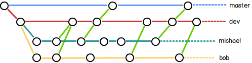

**参考**：
> https://www.liaoxuefeng.com/wiki/0013739516305929606dd18361248578c67b8067c8c017b000

-------

## 配置与概念
```bash
#配置
git config  --global user.name "guan"
git config  --global user.email "guan@xx.com"
#--global 这个参数，表示你这台机器上所有的Git仓库都会使用这个配置


#查看配置
git config --list

#查看某一个配置
git config user.name
git config user.email
```
**配置SSH**
ssh秘钥默认存储到~/.ssh文件夹中。若该文件夹中没有ssh秘钥，可以手动生成
```bash
# 生成ssh秘钥
ssh-keygen
```
这样得到了两个文件：id_rsa和id_rsa.pub，分别为私钥和公钥。
最后可以将pub公钥复制到gitlab/github中

**CRLF:**
- windows : CRLF( 回车换行 \r\n ) 
- Linux/Unix: LF (换行 \n) 
- Mac: LF(现在是换行, 以前是回车( Classic Mac )CR, \r )

如果是在Windows系统上，把它设置成true，这样当checkout代码时，LF会被转换成CRLF：
```bash
$ git config --global core.autocrlf true
```


-------
## 创建repository并初始化
```bash
git init

git init 路径

git init --bare 路径

```
## clone
```bash
# clone远程仓库到本地
git clone git@github.com:shanxu100/HelloSeries.git

# clone远程仓库的某个分支到本地
git clone <仓库地址> -b <branchName>

## clone到本地指定路径
git clone  <仓库地址> <本地路径>

```
-------------
## 基本操作
0. 查看版本库状态
```java
git status

git status -u
```

1. add：
```bash
#add指定一个文件
git add 文件

#下面两组命令的并集
git add -A
git add --all

# 监控工作区的状态树，使用它会把工作时的所有变化提交到暂存区.
# 包括文件内容修改(modified)以及新文件(new)，但不包括被删除的文件。
git add .

# 仅监控已经被add的文件（即tracked file）
# 包括被修改的文件提交到暂存区，不会提交新文件（untracked file）。
git add -u 
git add --update
```
参考：
[《git add 失效》](https://blog.csdn.net/qq_24147051/article/details/90520111)


2. commit:
- 普通提交
```bash
# 如果提交某一个文件，需要在最后指明文件名
git commit -m "This is a Message" 文件
```
- 文件被修改后，再次提交文件被修改后，再次提交

```bash
# 方式一：先对modified的文件进行add操作，然后在执行commit操作
git add -A
git commit -m "message"

# 方式二：增加 -a 参数，可以省去前面的add操作
git commit -am "This is a new message" 
```
3. 删除
```bash
git rm <fileName>
```

4. log
```bash
#最近的日志在最上面显示
git log 

#一行显示
git log --oneline  

git log --oneline --graph

```

5. ignore文件
```bash
#可忽略指定文件、指定文件夹、正则表达式匹配的文件
# 举例：
# 忽略folder下面的所有内容，但不包括folder文件夹本身
folder/
# 忽略folder下面的所有内容，同时包括folder本身。即忽略整个folder文件夹
folder
# 忽略所有以.iml文件结尾的文件。
*.iml

# * 表示匹配若干字符
# ? 表示匹配一个字符
```
**.gitignore只能忽略那些原来没有被track的文件，如果某些文件已经被纳入了版本管理中，则修改.gitignore是无效的。所以需要先把本地缓存删除，变成untrack的状态，然后再提交。**
```java
git rm -r --cached .
git add .
git commit -m 'update .gitignore'
```
6. GUI
```bash
##在gitBash中进入版本库的目录。执行命令
gitk
```
-----
## diff与checkout


- diff


```bash
#比较所有的文件
git diff

#比较指定文件
git diff 文件

git diff --cached
```

- checkout


## 分支

- master分支：git中的主分支
- head：指向当前分支

```bash
#查看分支
git branch
# 查看远程所有分支
git branch -r 
#查看本地和远程的所有分支
git branch -a 

#创建分支
git branch <branchname>

#切换到分支1
git checkout 分支1

#快捷：创建并切换分支（相当于上面两个命令的缩写）
git checkout -b 新分支名称

#查看所有分支
git branch -v

#查看分支列表？？？？
git branch -r

#合并到当前分支
#例：当前分支为master，将bugfix分支合并到当前分支中
git merge bugfix 

#删除本地分支
git branch -d <branchname1> <branchname2> <branchname3> 
-D：--delete --force的快捷键

#删除远程分支（将远程personal仓库的分支删除）
git push personal --delete <branchname1>

#重命名本地分支
git branch -m <oldbranch> <newbranch> 
-M：--move --force的快捷键
```

**策略**：

参考：[廖雪峰的官方网站-分支管理策略](https://www.liaoxuefeng.com/wiki/0013739516305929606dd18361248578c67b8067c8c017b000/0013758410364457b9e3d821f4244beb0fd69c61a185ae0000)
>在实际开发中，我们应该按照几个基本原则进行分支管理：
首先，**master**分支应该是非常稳定的，也就是仅用来发布新版本，平时不能在上面干活。那在哪干活呢？干活都在**dev**分支上，也就是说，dev分支是不稳定的，到某个时候，比如1.0版本发布时，再把dev分支合并到master上，在master分支发布1.0版本。你和你的小伙伴们每个人都在dev分支上干活，**每个人都有自己的分支**，时不时地往dev分支上合并就可以了。
所以，团队合作的分支看起来就像这样：


## stash暂存??
```bash
#暂存
git stash (save 省略的)

#列出暂存的list
git stash list

#恢复
git stash apply

#清空暂存的list
git stash clear

```

## 远程仓库
1. **关联远程仓库**
```bash
#关联
#其中的 origin 是一个名字，可以随便起。这个名字代表了这个远程仓库的地址。
#以后对这个远程仓库进行操作的话，是需要使用这个名字即可
git remote add origin https://github.com/shanxu100/gitTest.git

#查看关联列表
git remote -v
```
查看关联列表：
origin表示**名字**，就是添加关联的时候的设置名字。
后面的url是远程仓库地址

```bash
#删除关联的远程仓库
#origin是设置的远程仓库名字。
git remote remove origin
```
**注意：如果添加远程仓库关联后，重复添加，会提示如下错误：**
**fatal: remote  xxxxxxx  already exists.**
**所以是需要先删除旧的远程仓库，再重新添加**


2. **push**
```bash
#语法
git push <远程主机名> <本地分支名>:<远程分支名>

#把本地库的所有内容推送到远程库上
#意义：将本地的master分支推送到origin主机。如果origin主机的master分支不存在，则会被新建。
#-u：参数表示指定origin为默认主机。这样以后就可以不加任何参数使用git push了。
git push -u origion master

#表示将本地分支localbranch和远程仓库origin的master分支关联起来
git branch --set-upstream-to=origin/master localbranch

#push到默认主机
#simple方式
git push

#将当前分支推送到origin远程仓库
$ git push origin
 
```

3.  **pull**
**第一次的步骤**：
	1. 需要使用init命令初始化一个文件夹
	2. 然后使用pull命令拉取文件
	3. ...........修改文件并commit......(省略)
	4. 使用git remote add命令将本地仓库和远程仓库关联
	5. 使用push命令提交到远程仓库（第一次可能需要-u参数）
```bash
#pull
git pull <远程主机名> <远程分支名>:<本地分支名>
#例如：将远程主机origin的master分支拉取过来，与本地的brantest分支合并。
git pull origin master:brantest
#例如：将远程origin主机的master分支拉取过来和本地的当前分支进行合并。
git pull origin master

#从github上面拉取
git pull 地址
#例如：
git pull https://github.com/shanxu100/gitTest.git

#省略了地址
git pull

```
## pull和clone的区别
1. clone 是本地没有 repository 时，将远程 repository 整个下载过来。
2. pull 是本地有 repository 时，将远程 repository 里新的 commit 数据(如有的话)下载过来，并且与本地代码merge。

## pull和fetch的区别
- git fetch相当于是从远程获取最新版本到本地，但不会自动merge。
- 如果需要有选择的合并，git fetch是更好的选择；效果相同时，git pull将更为快捷。

-------
## tag相关

```bash
# 查看tag
git tag
# 根据通配符来过滤查看
git tag -l "*1.0*"

# 查看Tag详细信息
git show <tagName>

# 打tag
#待补充

#拉取tag信息
# pull代码的时候也会将tag一同拉取过来
git pull 
git pull --tags

#将tag同步到远程服务器
git push <远程主机名> <tagName>

# 推送本地所有tag
git push --tags

# 删除tag
git tag -d <tagName>
# 删除远端tag
git push origin :refs/tags/<tagName>

```


